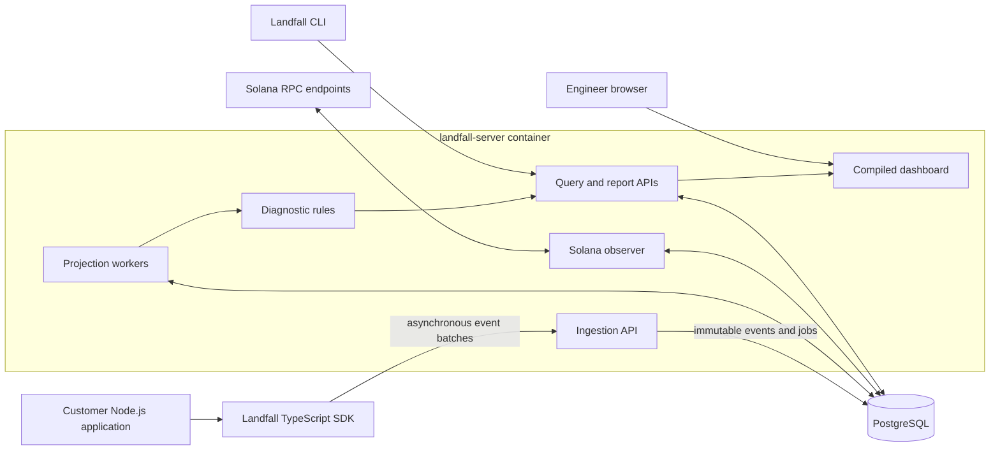

# Landfall

[](https://github.com/zgordan-vv/landfall/actions/workflows/ci.yml)
[](LICENSE)

Landfall is a vendor-neutral, self-hosted observability and diagnostic system
for the end-to-end lifecycle of Solana transactions.

It is designed to connect evidence that exists only inside an application—such
as construction, simulation, signing, submission, retries, routing, and
business intent—with RPC responses and observed on-chain outcomes. The result
is a correlated transaction timeline, evidence-linked diagnoses, reliability
metrics, and deterministic recommendations with explicit confidence.

> **Implementation status:** the reproducible monorepo, architecture
> boundaries, PostgreSQL environment, production-image foundation, and CI
> pipeline are implemented. Product behavior begins in Phase 2 with the event
> protocol and golden fixtures. Landfall is not production-ready yet.

## Why Landfall

A block explorer can explain a transaction that reached the chain, but it
cannot reconstruct application-side events that happened before submission or
a transaction that was never observed on-chain. Application logs, RPC provider
dashboards, and explorers each expose only part of the lifecycle.

Landfall is intended to answer questions such as:

- Was the transaction built, simulated, signed, and submitted as expected?
- Was a retry the same signed transaction or a replacement transaction?
- Did an RPC accept the request without a later on-chain observation?
- Did the validity window expire, or did execution fail on-chain?
- Which conclusion is confirmed, probable, or still unknown?
- Did a routing, fee, compute, or retry-policy change improve reliability?

Landfall does not hold private keys, sign or submit transactions for the user,
replace an RPC provider, or promise that a transaction will land.

## Target architecture

P0 is a modular monolith deployed as two containers: one Rust application and
one PostgreSQL database. The TypeScript SDK runs inside the customer's Node.js
application, while the CLI is an on-demand client.



The intended event path is:

1. The SDK records allowlisted lifecycle evidence without blocking the
   customer's transaction path.
2. The ingestion API authenticates and validates a batch, then atomically
   stores immutable events and projection jobs.
3. PostgreSQL workers lease jobs and process duplicate or out-of-order events
   idempotently.
4. Projectors derive typed relational read models from the immutable evidence.
5. The observer adds evidence from configured Solana RPC endpoints.
6. Versioned rules produce evidence-linked diagnoses and recommendations;
   query APIs expose them to the dashboard, CLI, and reports.

This keeps the source evidence replayable while avoiding Kafka, Redis,
ClickHouse, Kubernetes, or premature microservices for the expected P0 load.

## Repository structure

```text
apps/dashboard/          React dashboard source
crates/                  Rust modular-monolith crates
packages/                TypeScript protocol, SDK, and API client packages
docs/                    Product, architecture, security, and delivery design
scripts/                 Reproducible local and CI checks
.github/workflows/       GitHub Actions pipeline
docker-compose.yml       Local PostgreSQL environment
Dockerfile               Multi-stage landfall-server image
```

### Rust crates

| Crate               | Responsibility                                              |
| ------------------- | ----------------------------------------------------------- |
| `landfall-protocol` | Language-neutral event and API contract types               |
| `landfall-core`     | Deterministic lifecycle, diagnosis, and policy domain logic |
| `landfall-storage`  | PostgreSQL repositories, transactions, migrations, and jobs |
| `landfall-observer` | Solana RPC observation and evidence normalization           |
| `landfall-report`   | Portable diagnostic report generation                       |
| `landfall-server`   | HTTP API, workers, configuration, and composition root      |
| `landfall-cli`      | Operator and diagnostic command-line client                 |

The dependency direction is enforced automatically. Domain crates cannot
depend on HTTP, database, UI, or provider infrastructure. See
[Rust crate boundaries](crates/README.md).

### TypeScript packages

| Package                | Responsibility                                        |
| ---------------------- | ----------------------------------------------------- |
| `@landfall/protocol`   | Generated/verified event contract types               |
| `@landfall/sdk`        | Non-blocking application instrumentation and adapters |
| `@landfall/api-client` | Generated REST API client used by UI and integrations |
| `@landfall/dashboard`  | Private self-hosted React dashboard                   |

The SDK and dashboard do not import internal Rust or cross-package source files.
See [TypeScript workspace boundaries](packages/README.md).

## Key engineering decisions

| Topic           | Decision                                                                                                                             |
| --------------- | ------------------------------------------------------------------------------------------------------------------------------------ |
| Deployment      | [Modular monolith and two-container topology](docs/adr/001-modular-monolith-and-two-container-topology.md)                           |
| Source of truth | [Immutable event inputs and relational projections](docs/adr/002-immutable-event-inputs-and-relational-projections.md)               |
| Identity model  | [Business actions, traces, attempts, events, and aliases](docs/adr/003-business-action-trace-attempt-event-and-alias-identifiers.md) |
| Privacy         | [Privacy modes and signed-byte fingerprints](docs/adr/004-privacy-modes-and-signed-byte-fingerprints.md)                             |
| Event contracts | [JSON Schema and generated language types](docs/adr/005-json-schema-event-contract-and-code-generation.md)                           |
| Solana client   | [Solana Kit first adapter](docs/adr/006-solana-kit-first-adapter-and-compatibility-roadmap.md)                                       |
| Background work | [PostgreSQL job queue](docs/adr/007-postgresql-job-queue-instead-of-external-broker.md)                                              |
| REST contract   | [Code-first OpenAPI with Utoipa](docs/adr/008-code-first-openapi-with-utoipa.md)                                                     |

The complete, authoritative index is in [Architecture Decision Records](docs/adr/README.md).

## Getting started

The repository currently requires:

- Rust `1.98.0`;
- Node.js `24.20.0`;
- pnpm `11.25.0`;
- just `1.58.0`;
- Docker with Compose v2.

Clone and verify the workspace:

```sh
git clone https://github.com/zgordan-vv/landfall.git
cd landfall
just bootstrap
just check
```

Start and verify the private PostgreSQL service:

```sh
just db-up
```

Build and inspect the non-root server image:

```sh
just container-build
```

Additional security, contract, database-reset, and development commands are
documented in [CONTRIBUTING.md](CONTRIBUTING.md). The committed local database
credentials in `.env.example` are intentionally public development values;
PostgreSQL does not publish a host port.

## Documentation map

For a structured review, read the documents in this order:

1. [Idea Validation Strategy](docs/idea-validation-strategy.md) — who may buy
   this and how demand should be tested.
2. [Product Requirements Document](docs/product-requirements-document.md) —
   product scope, users, terminology, requirements, and acceptance criteria.
3. [System Design](docs/system-design.md) — functional and non-functional
   requirements, capacity, APIs, database, and detailed component design.
4. [Technical Implementation Plan](docs/technical-implementation-plan.md) —
   phased, task-level build sequence and technology choices.
5. [ADRs](docs/adr/README.md) — why consequential architecture choices were
   made.
6. [Threat Model](docs/threat-model.md) — assets, trust boundaries, threats,
   and mitigations.
7. [P0 Support Matrix](docs/support-matrix.md) — exact supported runtimes,
   database, Solana client, clusters, transaction versions, and privacy modes.

## Security and privacy

Landfall is designed around local-first, self-hosted operation. Private keys,
seed phrases, signing credentials, and raw signed transaction bytes are
prohibited. Standard privacy mode fingerprints exact signed transaction bytes
without retaining those bytes, and telemetry must fail open rather than break
the customer's transaction flow.

Do not report vulnerabilities in public issues. Follow [SECURITY.md](SECURITY.md).

## Commercial direction

The initial commercial wedge is a fixed-scope **Solana Transaction Reliability
Audit** supported by the self-hosted product. Paid pilots and repeated customer
evidence determine whether Landfall should later become a hosted multi-tenant
service; SaaS infrastructure is deliberately outside P0.

## License

Landfall is licensed under the [Apache License 2.0](LICENSE).
