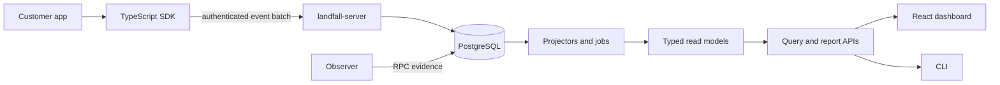

# Landfall architecture overview

Landfall is a self-hosted modular monolith for correlating application-side
Solana transaction evidence with later RPC observations.

## Data boundaries

- The SDK records allowlisted lifecycle evidence asynchronously and never
  receives private keys or seed phrases.
- The ingestion API authenticates and validates batches before an atomic event,
  deduplication, and job transaction commits.
- PostgreSQL is the durable source for immutable events, jobs, projections,
  observer evidence, and report metadata.
- Projectors are replayable: read models can be rebuilt from immutable events.
- The observer is best-effort enrichment; missing or malformed RPC evidence is
  represented as unknown rather than converted into success.
- Dashboard, CLI, and reports consume query contracts and do not bypass the
  storage boundary.

## Deployment shape

The P0 deployment is one Rust server image plus one PostgreSQL image. A trusted
reverse proxy terminates public TLS; PostgreSQL remains on a private network.
The detailed API, schema, failure boundaries, and capacity assumptions are in
[system-design.md](system-design.md), while decisions and trade-offs are in
[ADRs](adr/README.md).
