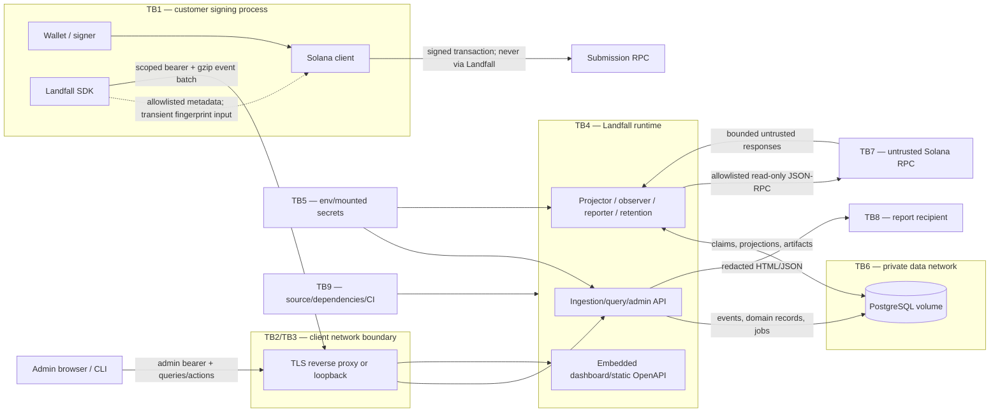

# Landfall P0 Implementation Threat Model

**Status:** Accepted for P0 implementation

**Date:** 2026-09-01

**Applies to:** Self-hosted P0 modular monolith, TypeScript SDK, Rust server and
CLI, PostgreSQL, local dashboard, Solana observation RPC, and portable reports

## 1. Purpose and authority

This document turns the security and privacy requirements in the PRD, system
design, and accepted ADRs into implementation constraints and release tests. It
answers four questions:

1. What assets and security properties does Landfall protect?
2. Where does data cross a trust boundary?
3. What can an attacker or failed dependency do at each boundary?
4. Which control and test must prevent or detect each material threat?

This is a design-time implementation threat model, not a penetration-test report,
compliance certification, or claim that a self-hosted deployment is secure under
all operator configurations. If this document conflicts with a later accepted ADR,
the ADR must update this threat model in the same change.

## 2. Security claims for P0

P0 is designed to make the following narrow claims:

- Landfall never requests private keys, seed phrases, or signer callbacks. The SDK
  may handle exact serialized signed transaction bytes transiently inside the
  customer process only to compute a fingerprint; those bytes are never placed in
  telemetry, transmitted to the server, persisted, logged, or displayed.
- Telemetry is allowlisted and bounded. Collector enforcement is authoritative;
  SDK validation is not a security boundary.
- A failed or unavailable Landfall SDK/collector does not determine whether the
  customer's Solana transaction is submitted.
- Ingest credentials authorize one environment only. Administrative credentials
  are separate and cannot be replaced by an ingest credential.
- A successful ingestion response means accepted events and their durable work
  committed to PostgreSQL.
- Solana RPC data is untrusted evidence. It cannot directly select SQL, filesystem
  paths, internal jobs, or new network destinations.
- Reports receive a second redaction pass and are published only when both format
  artifacts pass size, secret, and integrity checks.
- The default deployment binds locally, does not expose PostgreSQL, and emits no
  remote product analytics without explicit opt-in.

P0 does **not** claim hosted tenant isolation, protection from a malicious host
administrator, custody security, Solana program security, perfect observer truth,
anonymous telemetry, automatic backup erasure, or contractual availability.

## 3. Method and risk handling

The model follows the OWASP threat-modeling sequence: scope the system and data
flows, identify threats, map mitigations, and assess the result. STRIDE is used as
a prompt for spoofing, tampering, repudiation, information disclosure, denial of
service, and elevation of privilege. Privacy, abuse, dependency, and operational
failure scenarios are included because STRIDE alone does not cover the product's
commercially sensitive telemetry.

### 3.1 Qualitative ratings

Ratings are intentionally qualitative. They prioritize work; they are not CVSS
scores.

| Rating | Meaning for Landfall |
|---|---|
| Critical | Could persist/expose signing material, execute attacker-controlled code, cause broad irreversible deletion, or make telemetry causally break the customer's transaction path |
| High | Could expose or tamper with a full deployment dataset/credential, cross an authorization scope, or durably exhaust a core service |
| Medium | Requires a trusted credential or deployment mistake and has bounded disclosure, integrity, or availability impact |
| Low | Limited impact, difficult prerequisites, or strong independent detection/recovery |

`Initial` is the risk before the listed controls. `Residual` is the expected risk
after the controls and tests are implemented. No Critical residual risk and no
unreviewed High residual risk may ship in P0. Any exception requires a recorded
owner, justification, compensating control, review date, and expiry.

## 4. Scope and trust assumptions

### 4.1 In scope

- `@landfall/solana-kit` and the SDK core inside a customer Node.js process;
- HTTPS ingestion, query, configuration, report, deletion, health, and OpenAPI
  endpoints;
- dashboard and CLI clients;
- the modular-monolith roles: API, projector, observer, reporter, and retention;
- PostgreSQL raw events, projections, tokens, jobs, and report artifacts;
- configured Solana JSON-RPC observation routes;
- environment/mounted-file secret injection;
- Docker Compose network and volume defaults;
- schemas, generated API artifacts, dependencies, container, and release inputs;
- exported HTML/JSON reports after they leave the deployment.

### 4.2 Trusted assumptions

- The customer controls the host, Compose configuration, reverse proxy, DNS, and
  secret provisioning.
- The wallet/signer and customer application already have legitimate signing
  authority. Landfall receives no such authority.
- A holder of the P0 admin token is trusted to read, export, configure, and delete
  data across the local deployment. P0 has no human RBAC.
- Host root, Docker daemon administrators, PostgreSQL administrators, debuggers,
  and backup administrators can read or alter application data and secrets. P0 can
  document and reduce this exposure but cannot enforce security against them.
- The reverse proxy supplies TLS for non-loopback access. If proxy-to-server
  traffic crosses an untrusted network, that hop also requires protected transport.
- PostgreSQL durability, host encryption, backup protection, and restore access are
  operator responsibilities with product-provided guidance and checks.

### 4.3 Explicitly out of scope

- wallet, seed phrase, remote signer, and Solana program vulnerability analysis;
- compromise of the customer application's pre-existing dependencies other than
  Landfall's own package and release controls;
- provider-internal submission routing or proof of which route landed a transaction;
- malicious host/root/database administrator isolation;
- public hosted SaaS, organizations, tenant isolation, RBAC, billing, regions, and
  compliance controls;
- third-party database backups after they leave the documented deployment process;
- preventing a report recipient from intentionally redistributing a report they
  were authorized to receive.

Hosted operation, durable SDK disk spooling, object storage, browser-wallet capture,
arbitrary log ingestion, LLM processing, or transaction mutation requires a threat
model update before implementation.

## 5. Data classification and assets

### 5.1 Data classes

| Class | Examples | Required handling |
|---|---|---|
| P0-Prohibited | Private keys, seed phrases, signer secrets/callbacks, raw signed transaction bytes, authorization/cookie values, complete credential-bearing URLs | No contract field; reject before persistence; never log or export; security canaries prove absence |
| Secret | Ingest/admin bearer tokens, fingerprint HMAC keys, PostgreSQL credentials, full RPC endpoints/credentials | Deployment secret input only; no telemetry table or normal output; mask diagnostics; rotate/revoke on suspected disclosure |
| Restricted telemetry | Public signatures/addresses joined with flow, route, app version, timing, volume, business IDs, fingerprints, incidents, evidence, reports | Environment authorization, privacy mode, retention, redaction, no-store responses, controlled export |
| Internal operational | Job IDs, request IDs, token prefixes/IDs, rule/schema versions, aggregate health, sanitized error categories | Bounded, non-secret, least privilege; do not use identifiers as authorization |
| Public build data | Synthetic OpenAPI examples, schemas, documentation, checksums, release metadata | Must contain only synthetic data; secret scan before release |

Pattern-based secret detection is defense in depth. The primary control is that
closed schemas and typed models provide no place to put prohibited or arbitrary
data.

### 5.2 Assets and required properties

| Asset | Confidentiality | Integrity | Availability / lifecycle |
|---|---|---|---|
| Signing boundary | Landfall must receive none of its secret material | SDK cannot mutate or submit a transaction | Telemetry failure cannot block submission |
| API/fingerprint/RPC/database secrets | Never logged, stored in telemetry, or exported | Correct scope, key ID, and rotation state | Revocable/rotatable without undefined behavior |
| Raw accepted events | Restricted by environment/privacy policy | Immutable, schema-valid, deduplicated, versioned | Durable after `202`; retained/deleted by policy |
| Trace projections and diagnoses | Restricted telemetry | Deterministic from named evidence/rule version; contradictions retained | Rebuildable from retained events |
| Configuration and privacy mode | Secrets referenced, not embedded | Only admin/startup may change; cluster/mode explicit | Invalid/ambiguous config fails readiness |
| Jobs and leases | Payloads contain IDs and sanitized fields only | Public input cannot select handler/SQL/priority; fenced effects | Bounded retry, reclaim, dead-job visibility |
| Reports | Redacted for chosen export profile | Cohort watermark, versions, SHA-256, atomic publication | 10 MiB raw/stored caps; explicit retention/deletion |
| Logs and metrics | No secret or sensitive value dumps | Request/job correlation is trustworthy enough for operations | Bounded cardinality and retention |
| Schemas, generated contracts, binary/container | No environment-derived data | Reproducible, reviewed, pinned inputs | Recoverable build/release artifacts |

## 6. Actors and trust levels

| ID | Actor / level | Allowed authority | Must not be assumed |
|---|---|---|---|
| TL0 | Unauthenticated network/browser client | Public liveness and static OpenAPI only where configured | No data, configuration, job, report, or detailed-health access |
| TL1 | Holder of one valid ingest token | Submit bounded events for exactly one environment | Cannot query, export, configure, delete, create jobs, or choose an RPC route |
| TL2 | Holder of the deployment admin token | P0 local read/configure/export/delete operations | Not a hosted identity or least-privilege human role |
| TL3 | Landfall internal role | Execute its closed role handlers using trusted configuration | Public JSON never becomes an internal job command |
| TL4 | Runtime PostgreSQL role | Required DML on explicit Landfall schemas/tables | No superuser, role/database creation, arbitrary extensions, host access, or migration DDL |
| TL5 | Deployment operator / host or DB administrator | Full local control by deployment assumption | Product cannot hide data or secrets from this actor |
| EXT1 | Solana RPC/provider | Return bounded untrusted observation evidence | Never authoritative for local identity, authorization, SQL, job type, or network destination |
| EXT2 | Report recipient | Read the explicitly exported artifact | No authority to query the source deployment |
| EXT3 | Dependency/release publisher | Supplies pinned build inputs | Never trusted without lock, review, scanning, and reproducible-build controls |

A UUID, signature, trace ID, report ID, cursor, token prefix, or fingerprint is an
identifier, not proof of authorization.

## 7. Data-flow and trust-boundary model

### 7.1 Boundary rules

| Boundary | Crossing | Mandatory enforcement |
|---|---|---|
| TB1 | SDK observes customer transaction code | No custody/submission callback; typed capture; fingerprint bytes only transiently; fail-open isolation |
| TB2 | SDK to ingestion API | TLS or loopback; bearer in header; compressed and decompressed limits; authentication before expensive parsing |
| TB3 | Browser/CLI to admin/query API | Admin authentication; object/function authorization; exact same-origin CORS; output encoding; no credential persistence by Landfall |
| TB4 | Public handlers to internal roles | Closed domain commands; public fields cannot select job types, priority, SQL, paths, or destinations |
| TB5 | Secret source to runtime | Reference-based configuration; strict permissions; no display/log/schema/example; rotation health |
| TB6 | Runtime to PostgreSQL | Private network; TLS where network leaves host; least-privilege runtime role; parameterized SQL; migration role separate |
| TB7 | Runtime to RPC | Admin-configured destinations only; scheme/address policy; no redirects; bounded responses/timeouts; evidence treated as fallible |
| TB8 | Deployment to report recipient | Second redaction; escaping; offline CSP; size/checksum; explicit profile and warning |
| TB9 | Build inputs to release | Exact lockfiles, review/scans, generated-artifact drift checks, synthetic fixtures, SBOM/checksums before production claims |

## 8. Entry points and exit points

| Surface | Trust level | Security-sensitive behavior |
|---|---|---|
| `POST /api/v1/events:batch` | TL1 | Authentication, environment ownership, gzip/JSON limits, schema/privacy validation, atomic persistence |
| `POST /api/v1/health-check/events` | TL1 | Same pipeline; production signatures prohibited by default; short retention |
| Query/signature/business-action APIs | TL2 | Object scope, bounded ranges/page sizes, privacy-mode field filtering, no-store output |
| Report create/status/download | TL2 | Bounded cohort/selection, redaction profile, queued work, artifact integrity and safe headers |
| Recommendation disposition | TL2 | Bounded reason, append-only audit history, target reauthorization |
| Trace deletion/retention/replay | TL2 | Reauthorize canonical target, dry-run/confirmation where applicable, bounded idempotent job, audit record |
| Project/environment/route/token configuration | TL2 or startup operator | Closed fields, no secret echo, route egress policy, policy downgrade warning, token one-time display |
| `/health/live`, `/health/ready` | TL0 only on internal/default-safe interface | No dependency details, identifiers, errors, versions beyond required health semantics |
| `/api/v1/system/status` | TL2 | Sanitized detail; bounded health data/cardinality |
| `/api/openapi.json` | TL0 | Static synthetic artifact only; no live hostnames, tokens, signatures, or environment data |
| Interactive API docs | Development/loopback opt-in | Vendored assets; production default off; no token storage |
| CLI file/NDJSON ingestion | Local authorized operator | File size/line/depth bounds; same schema/privacy pipeline; no URL or implicit recursive directory input |
| Solana RPC client | Internal using admin configuration | Fixed method allowlist, destination and credential policy, response bounds, timeouts/backoff |
| PostgreSQL connection/migrations | Internal deployment | Separate credentials, exact schema version, no public exposure |
| Logs, metrics, report/file downloads, backups | Exit points | Redaction, classification, retention, permissions, explicit operator/recipient responsibility |

## 9. Non-negotiable implementation invariants

1. **No signing material:** P0 schemas and domain types contain no raw signed-byte,
   private-key, seed, signer, cookie, or arbitrary metadata field.
2. **Fail-open telemetry:** SDK capture, buffering, flush, and callbacks never wrap
   the customer's submission in a required await and never throw into the transaction
   path by default.
3. **Collector authority:** every event is authenticated, structurally validated,
   environment-authorized, privacy-checked, and bounded again on the server.
4. **Durability honesty:** `202` follows the event/dedup/job transaction commit;
   volatile buffering never produces an accepted response.
5. **Object authorization:** every handler scopes loaded resources by the authenticated
   authority, not merely by an attacker-provided UUID.
6. **Closed control plane:** public data cannot select internal job type, priority,
   retry policy, handler, SQL fragment, table, file path, or network destination.
7. **Bounded work:** bytes, decompressed bytes, JSON depth, events, strings, arrays,
   label cardinality, page size, time range, concurrency, retries, response size, and
   report size all have enforced ceilings.
8. **Untrusted presentation:** all stored text is untrusted when rendered in the
   dashboard, errors, logs, CLI, OpenAPI, and reports.
9. **Untrusted RPC:** observer results are version-checked evidence; conflict and
   absence remain visible and cannot create certainty unsupported by local rules.
10. **Secret-free diagnostics:** logs and errors identify category/path/ID only and
    never echo rejected values, authorization headers, URLs, payloads, or stack traces.
11. **Atomic publication/effects:** duplicate worker execution is safe; stale leases
    are fenced; report completion and both artifacts commit together.
12. **Deletion is enumerated:** active raw, dedup, alias/search, derived, job, and
    report targets are covered; backups are disclosed as a separate lifecycle.

## 10. Threat register

### 10.1 Signing boundary and SDK

| ID | STRIDE / scenario | Initial | Required P0 controls | Residual / disposition |
|---|---|---:|---|---|
| TM-001 | I: raw signed bytes, private key, seed, or signer object enters telemetry | Critical | Eliminate fields; typed adapter; HMAC only over exact signed bytes in process; discard bytes; dual SDK/collector prohibited-data checks; end-to-end canaries | Low; P0 release blocker if any sink contains a canary |
| TM-002 | D/E: SDK latency, exception, buffer growth, or shutdown flush changes transaction behavior | Critical | Asynchronous non-blocking capture; bounded memory; fail-open defaults; aggregate callbacks isolated from user path; bounded optional shutdown wait | Low; outage test must show original submission result is unchanged |
| TM-003 | I/E: compromised Landfall npm package uses customer-process access to exfiltrate signing material | Critical | Minimal package surface/dependencies; exact lock/provenance; review generated package; publish checksums; vulnerability/reporting process; never ask for signer callbacks | Medium accepted: any malicious in-process dependency may inspect process memory; disclose this boundary |
| TM-004 | T/R: application supplies false but structurally valid telemetry to manipulate a report | High | Environment token scope; immutable events; source/app/schema versions; contradictory evidence retained; deterministic rules; no claim that telemetry proves transaction ownership | Medium accepted: authorized application telemetry is evidence, not cryptographic truth |
| TM-005 | I: timing, public signature, address, flow, and volume correlation reveals trading strategy | High | P0 standard/full field minimization; low-cardinality labels; local-first deployment; retention; report-local pseudonyms; persistent full-mode warning; strict remains P1 | Medium accepted and disclosed; public values become sensitive when joined |

### 10.2 Authentication, authorization, and browser clients

| ID | STRIDE / scenario | Initial | Required P0 controls | Residual / disposition |
|---|---|---:|---|---|
| TM-006 | S/I: bearer token stolen from cleartext transport, URL, log, error, browser storage, or docs UI | High | `Authorization` header only; TLS/loopback; redact before tracing; never use query/cookie; one-time token display; admin dashboard token memory-only, not Local Storage; docs UI off in production | Low with correct deployment; non-loopback plaintext is unsupported |
| TM-007 | S: weak token is guessed or offline-brute-forced from its SHA-256 database hash | High | At least 256 CSPRNG bits after visible prefix; opaque token; unique hash; constant-time comparison; generic auth errors; rate/concurrency limits | Low; slow password hashing is unnecessary for uniformly random tokens |
| TM-008 | E/I: ingest token calls admin function or writes events for another environment by replacing IDs | High | Scope middleware plus handler-level environment ownership on every event/object; ignore no embedded authority; 403/hidden 404 policy; authorization matrix tests | Low; UUID unpredictability is never the control |
| TM-009 | E/I: admin/query endpoint loads a trace/report/recommendation by ID without rechecking scope | High | Central authorization service/repository predicates; target reload by authorized deployment/environment; route-set and negative BOLA tests | Low in P0; hosted mode requires a new tenant/RBAC model |
| TM-010 | S/I: revoked or expired token remains usable through an unsafe cache or race | High | Check expiry/revocation on use or bounded invalidatable cache; transactionally revoke; token ID/prefix audit; rotation overlap explicitly bounded | Low; verify maximum revocation propagation delay |
| TM-011 | E/I: stored XSS steals an in-memory admin token or issues admin requests | Critical | React text rendering by default; no raw HTML from telemetry; server-side validation; CSP (`default-src 'self'`, no inline script, `object-src 'none'`, `frame-ancestors 'none'`); exact same-origin CORS; security headers | Low after adversarial UI tests; any raw-HTML escape hatch needs review |
| TM-012 | S/E: CSRF, clickjacking, or permissive CORS triggers an admin action | High | Bearer header and no auth cookie; CORS disabled by default/dev exact-origin only; `frame-ancestors 'none'`; state-changing methods reject simple cross-origin content types | Low; switching to cookie auth requires a threat-model update and CSRF design |

### 10.3 Ingestion, parsing, and data integrity

| ID | STRIDE / scenario | Initial | Required P0 controls | Residual / disposition |
|---|---|---:|---|---|
| TM-013 | D: gzip bomb, chunked body, or declared-size lie exhausts memory/CPU before validation | High | Streaming compressed-byte cap; bounded decompressor with independent expansion cap; timeout; reject trailing bytes and concatenated gzip members; authenticate before expensive work; `413` | Low; property/integration tests measure maximum allocation and time |
| TM-014 | D/I: deeply nested, huge, duplicate-key, numeric-edge, or high-cardinality JSON abuses parser/database | High | 1 MiB/100-event P0 batch; depth/string/array/property bounds; closed schemas; typed large integers; reject duplicate object member names; cardinality controls; fuzzing | Low; parser/version upgrades rerun corpus |
| TM-015 | I: prohibited secret is smuggled through free text, URL encoding, nested objects, or renamed fields | Critical | No arbitrary objects; per-field allowlist/length/classification; canonical URL parsing; remove userinfo/query secret/path patterns; collector re-redaction; canary scanner across every sink | Low for modeled fields; encoded unknown secrets remain a residual reason to minimize text |
| TM-016 | I: validation error, panic, or rejected event reflects a secret to response/log/metric | High | Stable error code, bounded JSON pointer/category, no rejected value; sanitized panic boundary; no request-body/header debug; redaction-before-formatting | Low; snapshot and captured-log tests |
| TM-017 | T: replayed `event_id` changes ownership, overwrites immutable data, or poisons another environment | High | Global dedup claim first; immutable accepted event; duplicate content/ownership conflict detection; original record never overwritten; stable retry semantics | Low; malicious valid token can cause bounded integrity alerts/denial for a guessed ID |
| TM-018 | T: forged fingerprint/alias merges unrelated traces | High | Environment scope; algorithm/key ID allowlist; conflict detection; aliases auditable and transactional; signature corroboration where privacy permits; reversible repair tooling | Medium accepted: server cannot verify an HMAC fingerprint without prohibited raw bytes |
| TM-019 | T/E: SQL, filter, cursor, sort, path, or format injection reaches dynamic control flow | High | SQLx bind parameters; closed enums for sort/format; opaque authenticated/validated cursor; no user table/column/path; safe filename generation; negative fixtures | Low; any future dynamic query builder receives focused review |
| TM-020 | D: expensive ranges, exact counts, comparisons, reports, or deletions starve ingestion | High | Required bounded time ranges; page/selection limits; asynchronous jobs; lane concurrency; DB timeouts; query budgets; separate connection/concurrency limits | Medium; authenticated admin can still consume its own deployment resources |

### 10.4 RPC and outbound-network boundary

| ID | STRIDE / scenario | Initial | Required P0 controls | Residual / disposition |
|---|---|---:|---|---|
| TM-021 | E/I: RPC configuration becomes SSRF to metadata, Docker/Kubernetes control, loopback, file, or internal services | Critical | Only admin/startup config creates destinations; telemetry cannot carry a destination; `https` allowlist, explicit loopback-dev exception; reject userinfo and non-HTTP schemes; no redirects; always block link-local metadata/control endpoints; optional explicit private-network allowlist | Low for remote callers; trusted host admin is already TL5 |
| TM-022 | I: RPC credential leaks through stored URL, redirect, provider error, debug log, proxy, or metric label | High | Secret reference separate from route label; structured URL/headers; no redirects; sanitized errors; route ID/fingerprint metrics only; TLS certificate validation; no proxy-from-untrusted-env surprises | Low; process/host compromise remains in TL5 assumption |
| TM-023 | D/E: malicious RPC sends huge/deep/slow/malformed response or unsupported transaction version | High | Method-specific typed models; byte/depth/item limits; timeout/cancellation; version negotiation; bounded error capture; concurrency/rate limit; circuit/backoff | Low; provider outage still reduces evidence coverage |
| TM-024 | T/R: RPC lies, censors, equivocates, or returns stale/fork evidence that produces false certainty | High | Preserve source/time/commitment; deterministic certainty rules; contradictory observations visible; finality/expiry explicit; optional second observer/manual review; never claim provider-internal cause | Medium accepted: P0 cannot prove a single provider is truthful |
| TM-025 | D: rate-limit outage creates a retry storm that exhausts RPC, workers, or PostgreSQL | High | Full-jitter backoff; per-route and lane concurrency; durable due times; bounded attempts; shared block-height cache; no transaction held across RPC; outage health warning | Low/Medium; prolonged outage creates visible missing data, not invented results |

### 10.5 PostgreSQL, jobs, reports, and retention

| ID | STRIDE / scenario | Initial | Required P0 controls | Residual / disposition |
|---|---|---:|---|---|
| TM-026 | E/I/T: PostgreSQL is publicly exposed or runtime uses owner/superuser credentials | Critical | Private Compose network/no host publish; separate migration/runtime/backup roles; runtime no superuser/CREATEDB/CREATEROLE/BYPASSRLS/DDL; revoke unsafe `public` create; secret file/env permissions | Low under documented deployment; TL5 can override configuration |
| TM-027 | T/E: public input selects job type, priority, lease, retry, SQL, filesystem, or destination | Critical | API creates sanitized domain record; closed server-side job constructor; ID-only typed payload where possible; trusted priority/type constants; public schema excludes control fields | Low; schema/route negative tests are release gates |
| TM-028 | T/D: stale/duplicate worker commits effects twice or overwrites newer state | High | At-least-once design; effect-idempotency keys; lease version/fencing and DB time; generation checks; final effect/job transition transaction; crash injection | Low; external reads may repeat but cannot mutate customer transactions |
| TM-029 | I/D: report artifact is oversized, corrupted, a decompression bomb, or partially published | High | Askama escaping; second redaction/secret scan on raw bytes; raw/stored 10 MiB caps; bounded decompression; SHA-256 of canonical raw bytes; DB constraints; both artifacts + completed state in one transaction | Low; checksum detects corruption, not malicious TL5 modification of bytes and checksum |
| TM-030 | I/E: portable HTML executes injected script or leaks data through external resources | Critical | Askama default escaping; no `safe` for telemetry; self-contained assets; report CSP `default-src 'none'`, inline style only; no script/forms/network; safe content disposition/filename; `nosniff` | Low; recipient can intentionally share visible report data |
| TM-031 | I/T: deletion omits raw, dedup, aliases, jobs, artifacts, search IDs, or derived rows | High | Enumerated deletion plan; canonical scoped target; idempotent bounded job; integration inventory before/after; report reference handling; tombstone only when required | Low for active DB; backups remain separate residual risk |
| TM-032 | T/D: malicious or mistaken admin triggers broad retention/deletion/replay | High | Admin auth; scope reload; no public job controls; dry-run/count for bulk retention; explicit target and bounded batches; sanitized security audit record; restore documentation | Medium accepted: P0 admin is intentionally powerful and has no RBAC |
| TM-033 | I: database volume or backup is copied, or deleted data remains recoverable | High | Host/volume/backup encryption guidance; restrictive file/account access; documented backup retention; restore test; reports/telemetry classified restricted; deletion response names backup limitation | Medium accepted/operator-owned; no false immediate-erasure claim |

### 10.6 Configuration, observability, deployment, and supply chain

| ID | STRIDE / scenario | Initial | Required P0 controls | Residual / disposition |
|---|---|---:|---|---|
| TM-034 | I: authorization header, URL, signature path, payload, secret env, or stack trace enters logs/metrics/panic output | High | Structured allowlisted fields; request/path scrub before span creation; bounded error categories; no payload debug; cardinality tests; production backtrace off; captured-sink canaries | Low; host crash dumps require operator protection |
| TM-035 | T/I: privacy downgrade, wrong cluster, secret-reference mismatch, or unsafe public bind starts silently | High | Strict typed startup validation; genesis/cluster identity; privacy-policy/key ID; no fallback; readiness false; non-loopback requires explicit acknowledgement/proxy guidance; warnings persist in UI/status | Low; trusted operator may deliberately select permissive mode |
| TM-036 | I/E: detailed health, interactive docs, debug/CORS, or unnecessary method is exposed in production | High | Minimal public live/ready; admin system status; docs UI loopback/dev opt-in; exact methods/content types; CORS deny by default; security headers/no-store; route inventory equality test | Low; static OpenAPI remains intentionally public and synthetic |
| TM-037 | E/T/I: compromised dependency, code generator, schema, build script, or release artifact changes behavior or exfiltrates data | Critical | Exact Rust/npm lockfiles; minimal features/dependencies; review upgrades; vulnerability/license/secret scans; offline bundled schemas; generated drift checks; CI pinning; SBOM and artifact checksums before production release | Medium; no software supply chain can be made zero-risk |
| TM-038 | E/I/T: server/container compromise reaches all monolith roles, DB data, and RPC credentials | Critical | Non-root; read-only filesystem where practical; drop capabilities; no Docker socket; private DB; least-privilege DB; separate secrets; patched minimal image; role/concurrency boundaries; incident rotation | Medium accepted for P0 topology; split roles only after measured/security need |
| TM-039 | D: report/observer/retention workload or high-cardinality observability starves ingestion | High | Lane and role concurrency limits; bounded labels; connection-pool budgets; report work outside DB transaction; queue-age/latency alerts; mixed-load benchmark | Low/Medium; P0 is not an HA service and surfaces coverage loss |
| TM-040 | R: destructive/configuration actions cannot be attributed during an incident | Medium | Sanitized security audit event with request ID, token ID/prefix (never token), operation, target, time, result; append-only recommendation disposition; clock-skew health | Low for local operational investigation; not tenant-grade non-repudiation |

## 11. Required control design

### 11.1 Token lifecycle

- Generate at least 256 bits from the operating system CSPRNG and encode as an
  opaque value after `lf_ingest_` or `lf_admin_`.
- Display the full token once. Store token ID, non-secret prefix, SHA-256 hash,
  scope/environment, expiry, revocation, creation, and last-used metadata.
- Compare full hashes using a maintained constant-time primitive. Never compare a
  prefix as authentication.
- Support create-new, bounded overlap, client rollout, revoke-old rotation. Suspected
  disclosure skips normal overlap and revokes immediately.
- Authentication responses and latency must not reveal whether a token prefix,
  environment, or resource exists beyond the documented 401/403/404 policy.
- Never place bearer tokens in URLs, cookies, source-controlled files, report data,
  OpenAPI examples, persistent dashboard storage, or logs. RFC 6750's bearer-token
  warning applies: possession is sufficient for use, so transport and storage
  protection are mandatory.
- Secret values are not accepted through command-line arguments, where process
  listings and shell history may expose them; use environment or mounted secret
  inputs, with mounted files preferred when the deployment platform supports them.

### 11.2 Web and HTTP policy

- Same-origin dashboard/API in production; CORS absent/deny by default. Development
  permits only the exact configured dev-server origin, methods, and headers.
- Restricted API and report responses use `Cache-Control: no-store` and
  `X-Content-Type-Options: nosniff`; the dashboard sets `Referrer-Policy: no-referrer`
  and a reviewed CSP. TLS/HSTS is configured at the production reverse proxy.
- Trust forwarded headers only from explicitly configured proxy addresses. Remove
  any client-supplied forwarded headers at the edge.
- Provided reverse-proxy access logging must omit/scrub authorization and
  privacy-sensitive path/query values, especially signature lookup.
- Only declared routes/methods/content types exist. Request smuggling/desync defense
  requires supported patched proxy/server combinations and consistent body limits.
- Report filenames are generated from safe server IDs/enums, never free text.

### 11.3 Input and resource budgets

Every parser or expensive operation owns both a byte/element limit and a time or
concurrency limit. A downstream limit does not replace an upstream streaming limit.
In particular:

- authentication/header limit before decompression;
- compressed byte, decompressed byte, JSON depth, event count, and per-field limits;
- RPC response byte/depth/batch and error-text limits;
- query time range, filters, page size, selected traces, database statement timeout,
  and response-size limits;
- job attempts, lease duration, concurrency, error size, and queue retention limits;
- report raw/stored/decompressed size and generation concurrency limits;
- log field length and metric-label cardinality limits.

Limit failures return bounded errors and do not log rejected content.

### 11.4 RPC egress policy

RPC destinations originate only from startup/admin route configuration. P0 permits
the expected HTTP JSON-RPC methods; it is not a generic URL fetcher or proxy.

- Production default requires `https` and certificate validation.
- Loopback HTTP is an explicit development/local-validator exception.
- Userinfo, fragments, non-HTTP schemes, Unix sockets, redirects, and credentials in
  telemetry are prohibited.
- Automatic outbound proxies from ambient environment variables are disabled unless
  the operator explicitly configures and trusts that proxy.
- Cloud/link-local metadata and known container/orchestrator control endpoints are
  always blocked. Private-network endpoints require an explicit operator allowlist
  because self-hosted customers may intentionally run a private RPC.
- Validate the resolved connection target according to policy; do not validate one
  DNS answer and then follow a redirect/re-resolve to a forbidden address.
- Provider response bodies and errors are bounded and never reflected verbatim.

### 11.5 Database role separation

The runtime credential is not the database owner or migration credential. The
migration role performs reviewed DDL and is unavailable to the steady-state server.
The runtime role receives only required connect/usage/table/sequence privileges on
Landfall schemas. It cannot create roles/databases/extensions, bypass access
controls, read host files, or create arbitrary objects in `public`.

Provided Compose configuration does not publish the PostgreSQL port. Network TLS is
required when the database connection leaves the protected local/private boundary.
Backups use a separately controlled identity and are treated as Restricted telemetry.

### 11.6 Presentation and report safety

Stored strings are attacker-controlled even after schema validation. The dashboard
renders them as text and does not use raw HTML APIs. URL values displayed to users
are safe labels, not credential-bearing clickable endpoints.

Askama HTML escaping stays enabled. Any `safe` filter requires a dedicated newtype,
construction from static application markup only, security review, and a negative
test. Portable reports load no scripts, forms, frames, fonts, images, styles, or
network resources except explicitly embedded inert data permitted by the report CSP.

Export redaction is independent of storage privacy. A shareable export removes or
report-locally pseudonymizes stable identifiers, records the redaction policy/version,
and warns that timing/volume/incident narrative can still be identifying.

### 11.7 Secure build and release

- Commit exact dependency lockfiles and generated schemas/OpenAPI/client artifacts.
- CI regenerates contracts offline and fails on drift.
- Upgrades are isolated and reviewed for build scripts, features, licenses, and
  advisories; unused features/dependencies are removed.
- CI runs secret scanning, Rust/TypeScript static checks, tests, dependency/license
  policy, and container scanning. Findings are fixed or time-bounded with an owner.
- Release examples and snapshots use synthetic values only.
- Production release artifacts include dependency inventory/SBOM and cryptographic
  checksums; signing/provenance is added when release infrastructure is selected.
- Publish a vulnerability-reporting contact before production claims.

## 12. Abuse cases

### AB-01 — Compromised ingest token attempts data exfiltration

The caller sends another environment ID, guesses trace/report IDs, and tries query
and deletion endpoints. Expected result: the token can only reach event ingestion;
each event must match its environment, and all read/admin routes reject it. No
response reveals whether guessed objects exist.

### AB-02 — Secret-smuggling batch

The caller places canary keys/tokens in route URLs, errors, nested objects, Unicode
variants, and overlong fields, then triggers validation errors. Expected result:
closed schemas reject the batch atomically; responses/logs contain only safe paths
and categories; no canary reaches raw events, projections, jobs, metrics, UI, or
reports.

### AB-03 — Resource-exhaustion batch

The caller sends an oversized/chunked gzip with a small compressed size, excessive
JSON depth, 101 events, and many concurrent requests. Expected result: streaming
limits stop work before unbounded allocation, requests receive 413/429, and normal
ingestion remains within its latency/error budget.

### AB-04 — Stored presentation attack

An allowed display/error field contains HTML, script, event handlers, URL schemes,
terminal escapes, and spreadsheet-style formulas. Expected result: dashboard,
report, CLI, logs, and API show inert escaped/bounded text; CSP blocks script/network;
the value never becomes a filename, hyperlink destination, or control sequence.

### AB-05 — RPC SSRF and hostile provider

An admin route or compromised config targets metadata/link-local/control endpoints,
redirects to a second host, stalls, or returns huge/malformed/conflicting JSON.
Expected result: route policy blocks the destination/redirect; the adapter bounds
time/bytes/shape; conflict is retained as uncertain evidence; credentials and raw
responses do not enter diagnostics.

### AB-06 — Worker crash and stale completion

A worker crashes after claim, after RPC/render work, and immediately around final
commit. Another worker reclaims the job while the old worker attempts to commit.
Expected result: fencing rejects the stale worker, effect keys prevent duplication,
and no report becomes completed without both verified artifacts.

### AB-07 — Destructive operation with a replaced identifier

An admin request creates a deletion/replay job and substitutes another trace/project
ID in the body or job payload. Expected result: the handler reloads the canonical
target under current authority, ignores no embedded scope, audits the operation, and
deletes only the explicit enumerated target set.

### AB-08 — Privacy downgrade and report sharing

An operator changes from standard to full mode and exports a report with the least
restrictive profile. Expected result: startup/UI/status show the active mode and
policy version; downgrade does not claim old data was transformed; export requires
an explicit profile and still applies prohibited-secret scanning. Documentation
warns that authorized sharing can disclose strategy/timing even without secrets.

## 13. Security verification and release gates

| Gate | Required executable evidence |
|---|---|
| SEC-001 Non-custody | Contract/type tests prove no P0 schema accepts raw signed bytes, private keys, seed phrases, signer objects, headers/cookies, or arbitrary metadata |
| SEC-002 End-to-end canaries | SDK -> collector -> PostgreSQL -> API -> dashboard -> logs -> report scan contains zero prohibited secret fixtures |
| SEC-003 Fail-open SDK | Collector stopped/slow/malformed response, full buffer, callback throw, and shutdown tests do not change customer submission result or create unbounded wait/memory |
| SEC-004 Authentication | Missing, malformed, guessed, expired, revoked, ingest, and admin tokens exercise every endpoint; full tokens never appear in captured logs/errors |
| SEC-005 Object/function authorization | Negative matrix replaces every environment/project/trace/report/recommendation ID and proves correct 403/hidden-404 behavior and no state change |
| SEC-006 Request bounds | Compressed/decompressed/body/header/depth/string/array/event/concurrency boundary tests produce 400/413/429 without panic or excessive allocation |
| SEC-007 Parser fuzzing | JSON, gzip, URL, cursor, large-integer, duplicate/out-of-order event, RPC, and NDJSON fuzz/property corpus has no crash, hang, or contract bypass |
| SEC-008 Injection | SQL metacharacters, path traversal, header splitting, terminal escapes, and dynamic-sort/filter inputs remain inert under parameterized/closed code paths |
| SEC-009 XSS/browser | Stored attack fixtures render inert in every dashboard/report view; CSP/security headers/CORS/cache policy are asserted from real HTTP responses |
| SEC-010 RPC egress | Scheme, userinfo, redirect, DNS/IP policy, link-local metadata, private-network allowlist, timeout, oversized response, and credential-redaction tests pass |
| SEC-011 RPC integrity | Conflicting/stale/malformed/version-unsupported observations cannot produce unsupported certainty and retain source/evidence limitations |
| SEC-012 Database privilege | Real PostgreSQL test proves runtime role can perform required DML but cannot DDL, role/database/extension creation, unsafe schema creation, or unrelated reads |
| SEC-013 Queue control | Public API cannot set job controls; lease fencing, idempotency, retry exhaustion, dead jobs, crash points, and lane-starvation tests pass |
| SEC-014 Report safety | Raw/stored 10 MiB edges, bounded decompression, escaping, CSP, secret scan, SHA-256, content headers, and atomic two-artifact publication pass |
| SEC-015 Retention/deletion | Seeded trace inventory proves raw, dedup, alias/search, derived, job, and report targets are removed/tombstoned exactly once; backup warning is present |
| SEC-016 Deployment hardening | Default bind is loopback, PostgreSQL has no published port, server is non-root/no Docker socket, secrets are not in image/config, invalid privacy/cluster config fails readiness |
| SEC-017 Contract/release hygiene | Route inventory/auth linter, offline schema/OpenAPI regeneration, lockfile drift, secret/dependency/license/container scans, and synthetic artifact scan pass |
| SEC-018 Mixed-load resilience | 500 event/s burst plus observer outage/report/retention work remains bounded; ingestion, pool, queue age, memory, and drop metrics meet documented thresholds |
| SEC-019 Backup/restore | Production-pilot procedure restores a backup, verifies schema/checksums/access, and documents encryption, access, retention, and deletion limitations |
| SEC-020 Security auditability | Token lifecycle and destructive/configuration operations produce bounded sanitized records with request/token IDs, target, result, and stable time |

P0 may not be presented as production-ready while SEC-001 through SEC-018 have an
unresolved failure. SEC-019 is mandatory before a paid production pilot. SEC-020
provides local operational attribution, not hosted compliance-grade auditing.

## 14. Accepted residual risks and operator responsibilities

| Residual risk | Why it remains | Required disclosure / response |
|---|---|---|
| A malicious in-process SDK dependency may inspect customer application memory | JavaScript package runs inside the signing application process | Minimize/package-review dependencies; provenance/checksums; never market the SDK as a security boundary |
| A valid ingest token can submit false application evidence or forged HMAC fingerprints | Collector cannot verify the HMAC without receiving prohibited bytes | Treat telemetry as scoped evidence; conflict detection/auditable repair; rotate compromised token/key |
| A Solana RPC can lie, omit, lag, or equivocate | P0 consumes external evidence and has no consensus oracle | Preserve provider/source/commitment, show uncertainty, optionally compare observers |
| Standard-mode public signatures and all timing/volume data can be correlatable | Public fields become sensitive when joined with private context | Privacy warning, local deployment, retention, future strict P1 mode, re-pseudonymized shareable reports |
| P0 admin, host root, Docker/DB/backup administrator can read or destroy data | Self-hosted P0 deliberately has no privileged-operator isolation/RBAC | Restrict operator access, encrypt host/backups, protect admin token, maintain restore procedure |
| Server compromise reaches several monolith roles | P0 chooses one process for operational simplicity | Non-root/least privilege/secret separation; monitor and rotate; split roles only with a new risk decision |
| Deletion does not instantly erase independent backups or already shared reports | Copies are outside the live transaction and may be held by authorized recipients | State limitation in API/docs; define backup retention; never claim cryptographic erasure |
| Public non-loopback exposure can still be volumetrically DoSed | Application limits cannot absorb unlimited network traffic | Reverse-proxy/network limits and private access are operator requirements; P0 has no HA/SLA claim |
| Report SHA-256 detects accidental corruption, not a malicious DB/host admin changing bytes and checksum | No separate signing authority exists in P0 | Treat TL5 as trusted; add release/export signing only if a validated requirement appears |

## 15. Security operations

### 15.1 Minimum security signals

Expose counts and health without sensitive values:

- auth failure/rate-limit counts by safe token prefix or token ID;
- schema/privacy rejection category and redaction count;
- SDK dropped-event/coverage state;
- gzip/body limit rejection and request concurrency;
- RPC timeout/rate-limit/circuit state by route ID;
- queue oldest-ready/dead counts and lease conflicts;
- report size/scan failure category;
- retention/deletion result counts;
- privacy mode/policy/key ID and rotation age;
- dependency/build scan result in release evidence.

No metric label contains a signature, address, business action, free text, URL,
credential, report title, or unbounded customer label.

### 15.2 Credential or privacy incident

For suspected token, HMAC key, RPC credential, database credential, or prohibited
data exposure:

1. revoke/rotate the affected credential and stop unsafe ingress/egress;
2. preserve sanitized request/job/security records and identify the time/scope;
3. search active database, logs, reports, release artifacts, and backup inventory
   using approved canaries/indicators without copying the secret into new logs;
4. delete/quarantine active copies through the enumerated lifecycle and document
   backup/shared-report limitations;
5. assess forged events/aliases/reports and rebuild projections when integrity was
   affected;
6. patch the root cause, add a regression fixture, update this threat model, and
   communicate the honest scope to the operator/customer.

A public vulnerability-reporting contact and supported-version policy are required
before production claims.

## 16. Review triggers

Review this document at every release that changes a trust boundary, and immediately
when any of the following occurs:

- new API endpoint, role, data store, network destination, parser, export, or secret;
- raw transactions, logs, arbitrary metadata, durable SDK spool, object storage,
  webhook, plugin, LLM, or transaction mutation is proposed;
- browser authentication moves to cookies or persistent token storage;
- dashboard/API origins split or production CORS changes;
- hosted mode, multiple organizations, RBAC, or external user accounts are added;
- PostgreSQL, RPC, container, reverse-proxy, or backup topology changes;
- security control, privacy mode, retention, fingerprint, or supported transaction
  version changes;
- dependency/toolchain major upgrade or material vulnerability;
- security incident, penetration-test finding, or failed security gate;
- a pilot supplies a new sensitive-data or adversary assumption.

The reviewer records the date, changed flows/assets/threats, control/test updates,
accepted risks, and approving owner. An unchanged diagram is not evidence of an
unchanged threat model.

## 17. Traceability and references

Internal sources:

- [Product requirements: security and privacy](product-requirements-document.md#20-security-and-privacy-requirements)
- [System design: security and privacy](system-design.md#45-security-and-privacy)
- [System design: trust boundaries](system-design.md#72-trust-boundaries)
- [ADR-001: deployment topology](adr/001-modular-monolith-and-two-container-topology.md)
- [ADR-004: privacy modes and fingerprints](adr/004-privacy-modes-and-signed-byte-fingerprints.md)
- [ADR-005: event contract and validation](adr/005-json-schema-event-contract-and-code-generation.md)
- [ADR-007: PostgreSQL job queue](adr/007-postgresql-job-queue-instead-of-external-broker.md)
- [ADR-008: OpenAPI contract](adr/008-code-first-openapi-with-utoipa.md)
- [Report renderer and storage spike](spikes/report-renderer-and-artifact-storage.md)

External primary references:

- [OWASP Threat Modeling](https://owasp.org/www-community/Threat_Modeling)
- [OWASP API Security Top 10 — 2023](https://owasp.org/API-Security/editions/2023/en/0x00-header/)
- [OWASP API1: Broken Object Level Authorization](https://owasp.org/API-Security/editions/2023/en/0xa1-broken-object-level-authorization/)
- [OWASP API4: Unrestricted Resource Consumption](https://owasp.org/API-Security/editions/2023/en/0xa4-unrestricted-resource-consumption/)
- [OWASP API7: Server Side Request Forgery](https://owasp.org/API-Security/editions/2023/en/0xa7-server-side-request-forgery/)
- [OWASP API10: Unsafe Consumption of APIs](https://owasp.org/API-Security/editions/2023/en/0xaa-unsafe-consumption-of-apis/)
- [RFC 6750: Bearer Token Usage](https://www.rfc-editor.org/rfc/rfc6750.html)
- [NIST SP 800-218: Secure Software Development Framework](https://csrc.nist.gov/pubs/sp/800/218/final)
