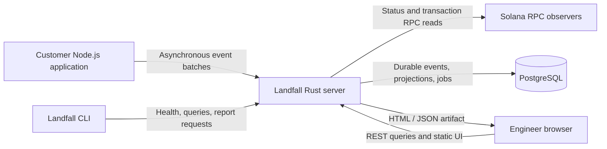
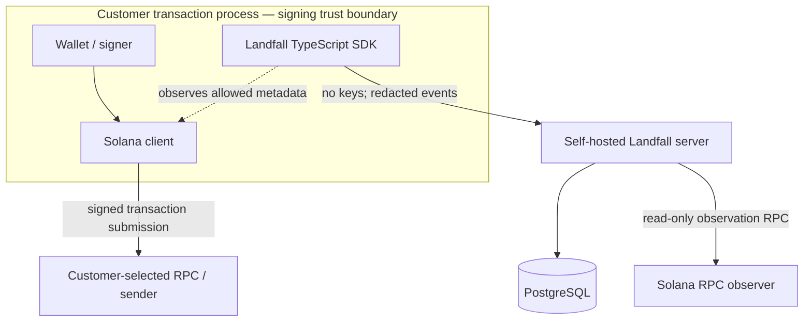
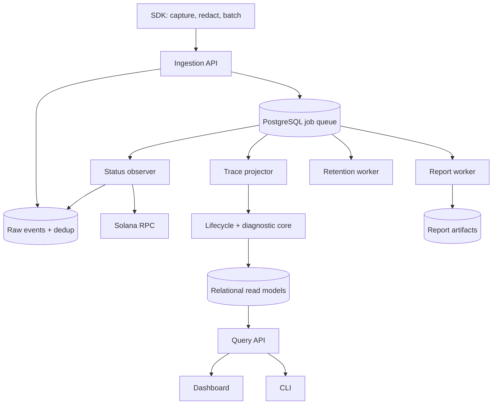
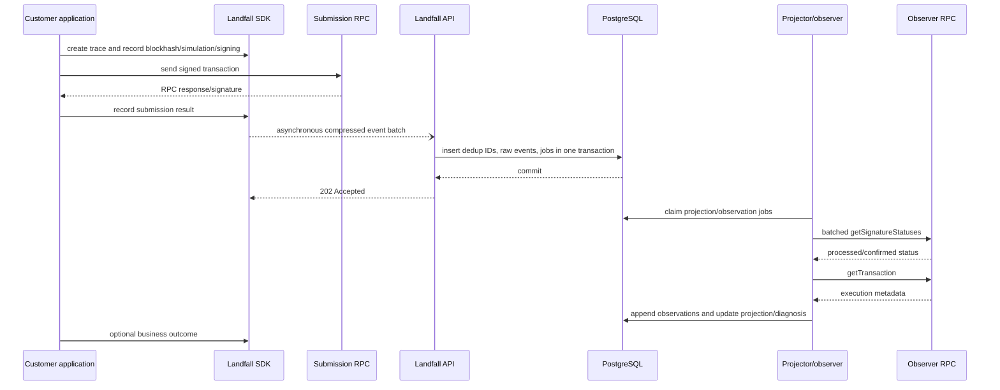
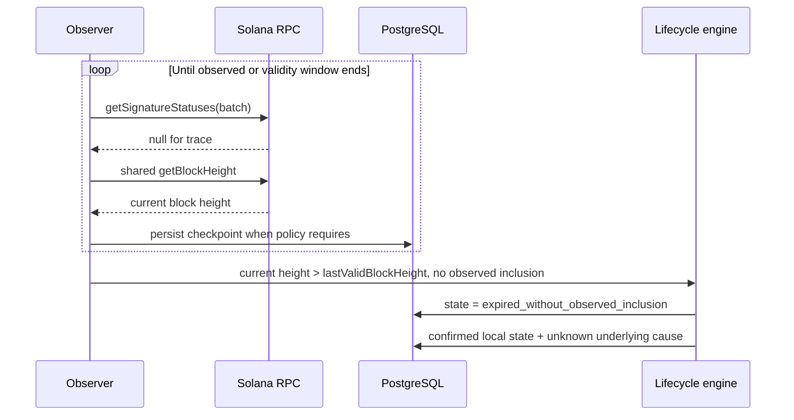
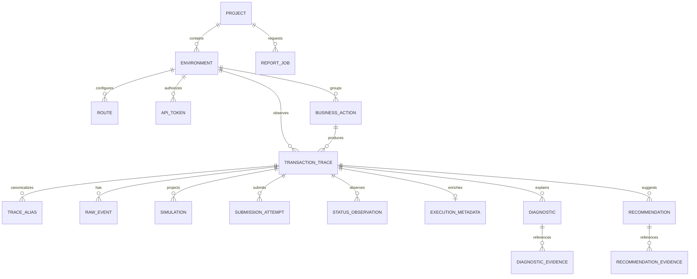
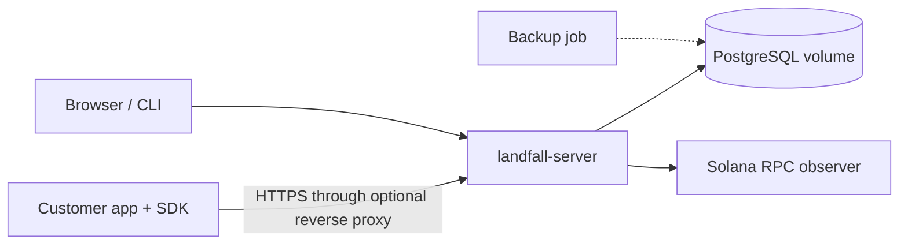

# Landfall System Design

Status: Draft for portfolio implementation  
Version: 0.1  
Date: 2026-08-29  
Working product name: **Landfall**  
Related documents: [Product Requirements Document](./product-requirements-document.md), [Technical Implementation Plan](./technical-implementation-plan.md), [Idea Validation Strategy](./idea-validation-strategy.md)

## 1. Purpose and scope

This document translates the Landfall PRD into an implementable system design for the self-hosted P0/R1 product. It describes the functional and non-functional requirements, capacity model, API contracts, high-level architecture, database schema, and internal design of every major component.

The design is intentionally suitable for a portfolio project and a real early customer:

- technically substantial enough to demonstrate Rust, TypeScript, PostgreSQL, event processing, Solana RPC, observability, security, and frontend integration;
- small enough for one developer to build and explain;
- correct at the boundary between known evidence and uncertain diagnosis;
- scalable within the expected early workload without Kafka, Redis, ClickHouse, Kubernetes, or microservices;
- structured so components can be separated later without rewriting domain logic.

This is a design document, not implementation. No source code or runtime infrastructure is created by this document.

## 2. Design context

### 2.1 Product boundary

Landfall observes a transaction from the customer application to its observed Solana outcome. It does not submit transactions on behalf of the customer, hold keys, sign messages, or guarantee landing.

The system receives application-side lifecycle events, observes signatures through configured Solana RPC endpoints, derives a deterministic lifecycle projection, produces evidence-linked diagnoses and recommendations, and exposes the result through APIs, a dashboard, a CLI, and portable reports.

### 2.2 P0 deployment model

P0 is a single-team, self-hosted deployment with two runtime containers:

1. `landfall-server`: one Rust binary containing API, projection, observer, diagnosis, report, and retention modules. It also serves the compiled dashboard assets.
2. `postgres`: the durable store, idempotency registry, and background-job queue.

The TypeScript SDK runs inside the customer's Node.js application. The CLI runs on demand. No externally hosted Landfall control plane is required.

### 2.3 Architectural style

P0 uses a **modular monolith with event-sourced inputs and derived relational projections**.

- “Modular monolith” means one deployable Rust server with explicit internal component boundaries.
- “Event-sourced inputs” means lifecycle evidence is written as immutable events.
- “Derived relational projections” means the dashboard does not reconstruct every trace from JSON on each request; workers convert events into typed query tables.

This design gives reproducibility and auditability without the operational cost of distributed services.

### 2.4 Key decisions

| Decision | Choice | Reason |
|---|---|---|
| Backend language | Rust | Safety, concurrency, deterministic domain core, portfolio value |
| Application integration | TypeScript SDK first | Common server-side Solana integration surface; exact client adapter remains pilot-driven |
| API style | REST/JSON over HTTP | Easy SDK, CLI, browser, and curl integration; schemas can be published as OpenAPI |
| Ingestion | Asynchronous batches | Keeps telemetry off the transaction critical path and reduces request overhead |
| Persistence | PostgreSQL | Handles P0 volume, JSON plus relational data, transactions, queue semantics, and reporting |
| Background queue | PostgreSQL job table | Avoids Redis/Kafka while supporting idempotent workers with `SKIP LOCKED` |
| Source of truth | Immutable raw events | Enables deterministic replay and rule-version audits |
| Read model | Typed relational projections | Fast trace, filter, and metric queries |
| Dashboard delivery | Static build served by Rust | Reduces production containers while preserving separate frontend source |
| Diagnostic engine | Versioned deterministic rules | Reviewable and reproducible; no LLM authority |
| Consistency | Durable ingestion, eventual projection | `202 Accepted` means events are durable, not yet fully analyzed |
| Raw transaction storage | Disabled by default | Not required for core value and increases security risk |
| Hosted multi-tenancy | Deferred | P0 is self-hosted; tenant security and billing are separate future work |

## 3. Functional requirements

The PRD remains the canonical source for product-level acceptance wording. This section groups those requirements by technical capability and explains what the system must do.

### 3.1 Project and environment configuration

The system shall:

- support one or more projects and named environments;
- associate every event and trace with exactly one project and environment;
- identify the Solana cluster for each environment;
- maintain named submission routes and observer routes without copying credentials into telemetry;
- support flow, application-version, SDK-version, fee-policy, compute-policy, and retry-policy labels;
- prevent unbounded custom-label cardinality;
- expose the active schema, rule-set, collector, and observer versions.

PRD mapping: `FR-CONFIG-001` through `FR-CONFIG-004`.

### 3.2 Application instrumentation

The TypeScript SDK shall:

- create a trace before submission;
- optionally associate multiple transaction traces with one business action;
- capture blockhash, `lastValidBlockHeight`, commitment, simulation, signing, submission, confirmation-wait, retry, and business-outcome events when available;
- distinguish retries of identical signed bytes from replacement transactions;
- calculate a signed-bytes fingerprint without storing the bytes by default;
- emit only allowlisted structured fields;
- remove RPC credentials and prohibited secrets;
- buffer and send telemetry asynchronously;
- never cause transaction submission to fail merely because Landfall is unavailable;
- expose a manual neutral event API when no client-library adapter exists.

PRD mapping: `FR-SDK-001` through `FR-SDK-006`.

### 3.3 Event ingestion

The collector shall:

- authenticate ingestion tokens;
- accept gzip-compressed event batches;
- validate envelope version, types, sizes, project/environment ownership, event order-independent semantics, and privacy policy;
- reject a structurally or security-invalid batch atomically;
- accept replays idempotently by `event_id`;
- persist accepted new events before returning `202 Accepted`;
- record source time and collector-receive time separately;
- enqueue projection work in the same database transaction;
- expose structured errors without echoing sensitive values.

PRD mapping: `FR-INGEST-001` through `FR-INGEST-003`.

### 3.4 Lifecycle observation

The observer shall:

- poll signature status through configured observer RPCs;
- batch signature checks;
- track block height independently of individual traces;
- determine when a normal recent-blockhash validity window has passed;
- fetch transaction metadata after a sufficiently strong observation;
- preserve source, commitment, slot, error, latency, and observation time;
- handle null responses as observations rather than proof of non-delivery;
- rate-limit and back off per RPC source;
- stop according to finality, expiration, privacy, and retention policies;
- avoid applying recent-blockhash expiration rules to unsupported durable-nonce flows.

Current official Solana constraints incorporated into this design:

- `getSignatureStatuses` accepts up to 256 signatures per request and normally searches the recent status cache unless history search is enabled: [official documentation](https://solana.com/docs/rpc/http/getsignaturestatuses).
- `getLatestBlockhash` returns both `blockhash` and `lastValidBlockHeight`: [official documentation](https://solana.com/docs/rpc/http/getlatestblockhash).
- expiration checks should use block height rather than a fixed wall-clock timeout: [official confirmation guidance](https://solana.com/developers/cookbook/transactions/confirmation).
- `getTransaction` can return `null` and requires explicit transaction-version support: [official documentation](https://solana.com/docs/rpc/http/gettransaction).

PRD mapping: `FR-OBS-001` through `FR-OBS-003`, `FR-OBS-006`.

### 3.5 Lifecycle derivation

The projection engine shall:

- derive state from immutable events rather than accept a client-supplied final state;
- tolerate duplicate and out-of-order delivery;
- group identical-byte resubmissions into submission attempts beneath one trace;
- group replacement traces beneath a business action when the customer supplies correlation;
- separate stage, landing state, execution result, and confirmation commitment;
- use a completed observation window for terminal-rate denominators;
- preserve conflicting and superseded evidence;
- support deterministic replay under a named projection version.

PRD mapping: `FR-LIFE-001` through `FR-LIFE-003`.

### 3.6 Diagnosis and recommendations

The diagnostic engine shall:

- evaluate versioned deterministic rules;
- attach every conclusion to supporting event IDs;
- label claims as confirmed, probable, or unknown;
- name alternative explanations for probable claims;
- identify missing evidence when no defensible diagnosis exists;
- calculate a data-quality grade independently of transaction success;
- create advisory blockhash, compute, fee-observability, and retry recommendations;
- never automatically modify, sign, submit, or retry a transaction;
- preserve old diagnoses after rule-set upgrades;
- record user disposition of recommendations.

PRD mapping: `FR-DIAG-001` through `FR-DIAG-005`, `FR-REC-001` through `FR-REC-006`.

### 3.7 Search, metrics, comparisons, and reports

The query layer shall:

- search traces by trace ID, signature when permitted, business action, time, flow, route, version, state, execution result, diagnosis, and data quality;
- expose a chronological evidence timeline;
- calculate landing, execution-success, end-to-end-success, latency, expiration, retry, cost, and diagnostic-coverage metrics using PRD definitions;
- exclude incomplete observation windows from terminal denominators;
- avoid attributing landing to one of several submission routes without proof;
- compare two bounded cohorts and display sample size and missing-data rate;
- export sanitized HTML and JSON reports with schema/rule versions and limitations;
- allow recommendation disposition and trace deletion.

PRD mapping: `FR-METRIC-*`, `FR-UI-*`, `FR-REPORT-*`, `FR-ADMIN-001`.

### 3.8 Health and operations

The system shall:

- provide liveness and readiness endpoints;
- expose health of database, projection queue, observer routes, and report jobs;
- provide a CLI health check for schema compatibility, privacy mode, clock skew, redaction, and event completeness;
- enforce configurable retention;
- report internal event drops, redactions, projection lag, RPC errors, queue depth, and query latency;
- run without outbound Landfall analytics unless explicitly enabled.

## 4. Non-functional requirements

### 4.1 Reliability

| ID | Requirement | Design response |
|---|---|---|
| NFR-REL-001 | Telemetry must fail open | SDK uses an asynchronous bounded buffer; no collector call is awaited before customer submission |
| NFR-REL-002 | Ingestion is idempotent | Globally unique event ID plus deduplication registry |
| NFR-REL-003 | Projection is reproducible | Append-only events, versioned reducer, deterministic ordering |
| NFR-REL-004 | Observer gaps do not become false causes | Gaps lower data quality and produce `observation_incomplete` or `unknown` |
| NFR-REL-005 | Worker jobs survive restart | PostgreSQL-backed jobs with leases, attempts, and retry time |
| NFR-REL-006 | Partial batch writes are prevented | Validation precedes one database transaction |
| NFR-REL-007 | Late events are preserved | Trace is reprojected and prior conclusions are superseded, not erased |

P0 is not a high-availability product. A single server restart may temporarily stop ingestion or observation. Durable events already acknowledged remain in PostgreSQL. HA deployment is a later operational profile, not a hidden P0 promise.

### 4.2 Performance

- SDK synchronous p95 overhead: under 5 ms, excluding the original RPC operation.
- SDK adds no synchronous network call to the customer's transaction path.
- Batch-ingestion p95: under 250 ms for 100 events on reference hardware.
- Collector sustained target: at least 500 events/second.
- Projection lag p95 under design load: under 5 seconds.
- Trace-detail API p95: under 500 ms for retained design volume.
- Overview API p95: under 2 seconds for a 24-hour window.
- Portable report: under 10 seconds for 100,000 traces.

All performance claims require a published dataset, hardware profile, versions, and benchmark command.

### 4.3 Scalability

- P0 design point: approximately one million accepted events/day.
- Event storage is time-partition-ready.
- Status calls are batched and rate-limited per observer.
- API processes are stateless except for bounded in-memory buffers and caches.
- Background jobs use database leases so another process can later share work.
- Query APIs require bounded time ranges for collection endpoints.
- Cardinality of flow and policy labels is limited.

### 4.4 Consistency

Landfall uses two consistency levels:

1. **Durable ingestion:** `202 Accepted` means all non-duplicate events in the batch committed to PostgreSQL.
2. **Eventual analysis:** lifecycle, diagnostics, metrics, and reports may lag ingestion. Query responses expose `as_of` and projection watermark information.

The dashboard must show “processing” rather than an empty or incorrect terminal state when events are durable but not yet projected.

### 4.5 Security and privacy

The [P0 implementation threat model](threat-model.md) defines the authoritative
trust boundaries, threat register, required controls, accepted residual risks, and
executable security release gates for this design.

- No private key, seed phrase, signer secret, authorization header, cookie, or credential-bearing URL may be persisted.
- Event attributes use allowlists and size limits.
- Ingestion and admin tokens are high-entropy and stored only as hashes.
- Standard mode stores public signature but not raw signed bytes.
- Full diagnostic mode requires explicit configuration for account/program fields.
- Strict mode is P1 and performs status observation within the customer boundary.
- Report export performs a second redaction pass.
- API access logs scrub signature search paths and authorization headers.
- Database uses a least-privilege application role.
- Self-hosted analytics are opt-in only.

### 4.6 Availability and recoverability

P0 objectives, not contractual SLAs:

- clean restart after process termination;
- no loss of acknowledged events when PostgreSQL remains durable;
- queue leases recover automatically after worker death;
- daily database backup documentation;
- restoration procedure tested before a production pilot;
- point-in-time recovery is optional for a portfolio deployment and recommended for a paid production pilot.

### 4.7 Maintainability

- domain logic lives in `landfall-core` without Axum, SQLx, React, or provider dependencies;
- every authoritative rule has positive, negative, missing-data, and contradictory-data fixtures;
- public API and event schemas are versioned;
- database migrations are reviewed and tested on a copy of realistic data;
- provider-specific error mapping stays behind adapters;
- component contracts use domain types rather than unbounded JSON.

### 4.8 Portability

- Linux `amd64` and `arm64` container images;
- Node.js 24 LTS TypeScript SDK;
- PostgreSQL version selected and pinned during implementation;
- local validator, devnet, and mainnet environments;
- Docker Compose is the supported P0 deployment mechanism.

### 4.9 Accessibility

- state is never represented by color alone;
- certainty and metric definitions are readable from the UI;
- keyboard-accessible trace tables and controls;
- UTC storage with explicit display timezone;
- lamports, micro-lamports, and human-readable units are named, never inferred.

## 5. Capacity estimation

Capacity figures are engineering assumptions, not observed customer facts. They establish a testable reference target and must be replaced with measurements from the first real pilot.

### 5.1 Workload units

The important units are different:

- **business actions/day**: customer intentions;
- **transaction traces/day**: distinct signed transactions;
- **submission attempts/day**: route calls, including identical-byte retries;
- **events/day**: SDK and observer evidence;
- **RPC checks/day**: external observation calls;
- **retained traces**: queryable derived records.

The design cannot size only by “transactions per second” because one transaction creates multiple events and polls.

### 5.2 Per-trace planning assumptions

For capacity planning, one normal trace averages:

| Evidence | Average records/events |
|---|---:|
| Trace, blockhash, and configuration | 2 |
| Simulation start/result | 2 |
| Signing start/result | 2 |
| Submission start/result | 2.4, assuming 1.2 attempts |
| Confirmation wait and application result | 2 |
| Persisted status observations | 5 |
| Execution/business enrichment | 1.5 |
| **Total** | **approximately 17–18** |

Not every RPC poll is persisted as an individual trace event. The observer stores the first null observation, status changes, periodic evidence checkpoints, and the terminal observation. Repeated identical null polls are counted in internal metrics and can be summarized. This controls storage without pretending that no polling occurred.

### 5.3 Workload scenarios

| Scenario | Traces/day | Events/trace | Events/day | Average events/s | Planned burst |
|---|---:|---:|---:|---:|---:|
| Portfolio/demo | 1,000 | 18 | 18,000 | 0.2 | 25/s |
| Small production team | 10,000 | 18 | 180,000 | 2.1 | 100/s |
| P0 design point | 50,000 | 18 | 900,000, rounded to 1M | 11.6 | 500/s |
| Stress test, not guaranteed | 100,000 | 18 | 1.8M | 20.8 | 1,000/s |

The burst target is intentionally much larger than daily average because bots and launches are highly uneven. The documented collector target of 500 events/second covers the P0 design point but not the stress row as a guaranteed sustained workload.

### 5.4 Ingestion request rate

Default SDK batching assumptions:

- flush at 50 events or 250 ms, whichever occurs first;
- maximum 100 events per request;
- maximum 1 MiB decompressed body;
- gzip used above a small configurable threshold.

At one million events/day and 50 events per average batch:

```text
1,000,000 / 50 = 20,000 ingestion requests/day
20,000 / 86,400 = 0.23 requests/second average
500 burst events/second / 50 = about 10 requests/second burst
```

HTTP request rate is therefore modest; event validation, database writes, and projection behavior matter more than socket count.

### 5.5 Network bandwidth

Assume an average validated event envelope of 1.2 KiB before compression:

```text
1,000,000 × 1.2 KiB ≈ 1.2 GiB/day uncompressed
average inbound payload bandwidth ≈ 14 KiB/second
500 events/second burst ≈ 600 KiB/second before compression
```

JSON usually compresses well because keys repeat. Capacity should not depend on a promised ratio, but 0.4–0.7 GiB/day over the wire is a reasonable benchmark hypothesis to measure.

### 5.6 Database storage

Planning estimates include row, index, and alignment overhead rather than only JSON length.

#### Raw events

Assumption: 2.2 KiB effective database footprint per raw event, including primary indexes and deduplication overhead.

```text
1,000,000 × 2.2 KiB ≈ 2.2 GiB/day
14-day raw-event retention ≈ 31 GiB
```

#### Derived projections

Assumption: approximately 8 KiB effective relational footprint per trace across trace, attempt, observation, execution, diagnosis, and indexes.

```text
50,000 traces/day × 8 KiB ≈ 0.4 GiB/day
30-day projection retention ≈ 12 GiB
```

#### Other storage

- control/configuration: negligible at P0 scale;
- job queue: normally below 1 GiB with completed jobs deleted;
- reports: budget 2–5 GiB with explicit artifact limits;
- PostgreSQL WAL, temporary files, vacuum headroom, and operational margin: 1.5–2× live data.

Recommended reference disk for the design point: **100 GiB SSD**. The portfolio/demo profile can run with 10–20 GiB.

These values must be benchmarked using actual encoded events. If a trace stores full logs or raw transactions, the estimate is invalid; those fields are disabled by default.

### 5.7 PostgreSQL sizing

Reference profiles:

| Profile | App CPU/RAM | PostgreSQL CPU/RAM | SSD |
|---|---|---|---|
| Local demo | Shared 2 vCPU / 4 GiB | Same Docker host | 10–20 GiB |
| P0 production reference | 2–4 vCPU / 4–8 GiB | 4 vCPU / 8–16 GiB | 100 GiB |

This is a starting benchmark profile, not a mandatory cloud SKU. A single host may run both containers if memory and disk latency are sufficient.

### 5.8 Observer RPC capacity

At 50,000 traces/day, assume:

- 12 in-memory status checks per trace on average;
- persisted status evidence is coalesced to about 5 records per trace;
- 95% of traces eventually require one `getTransaction` enrichment;
- one shared `getBlockHeight` call per observer per second.

Signature checks:

```text
50,000 × 12 = 600,000 signature checks/day
at 100 signatures per batch = 6,000 getSignatureStatuses calls/day
average ≈ 0.07 calls/second, with bursts governed by rate limiting
```

Although the protocol supports up to 256 signatures in one call, Landfall defaults to 100 to limit payload size, latency coupling, and provider-specific restrictions.

Transaction enrichment:

```text
50,000 × 95% = 47,500 getTransaction calls/day
average ≈ 0.55 calls/second
20× peak arrival can require roughly 10–12 calls/second temporarily
```

Block height:

```text
1 call/second × 86,400 seconds = 86,400 calls/day per observer
```

The observer must respect purchased RPC limits, batch status calls, cache block height, use exponential backoff with jitter, and place enrichment behind status tracking so it cannot starve expiry checks.

### 5.9 Active observation set

If an ordinary trace remains active for roughly 90 seconds:

```text
50,000 traces/day / 86,400 × 90 ≈ 52 concurrent traces on average
20× burst ≈ 1,040 concurrent traces
```

A small in-memory scheduler can manage this set, but PostgreSQL remains the durable source of scheduled work so restart does not lose observation responsibility.

### 5.10 Capacity evolution triggers

The design should be revisited when any of these occur:

- more than 10 million accepted events/day;
- retained database size above 500 GiB;
- projection lag exceeds 30 seconds under normal load;
- common 24-hour queries exceed the 2-second target after indexing;
- observer work consistently exceeds RPC quotas;
- report jobs materially affect ingestion latency;
- hosted multi-tenancy requires isolation or regional placement.

Possible later changes include separating server roles, adding a durable broker, moving analytical events to ClickHouse, using object storage for reports, and deploying multiple observer workers. None is justified for P0 by current capacity.

## 6. API design

### 6.1 API principles

- Base path: `/api/v1`.
- JSON request and response bodies.
- RFC 3339 UTC timestamps.
- Integers that can exceed safe JavaScript range are decimal strings.
- UUIDv7 identifiers where time-sortable identifiers are useful.
- Opaque cursor pagination, never page-number pagination on event/trace collections.
- `202 Accepted` for durable ingestion or queued report work.
- `200 OK` for completed reads and idempotent duplicate batch replay.
- Structured error codes stable across human message changes.
- OpenAPI is generated or verified in CI.
- Query endpoints use bounded time ranges and explicit limits.

### 6.2 Authentication and authorization

P0 has two token scopes:

- `ingest`: can submit events only for one environment;
- `admin`: can query, configure, export, and delete within the local deployment.

Token format is a high-entropy random value with a visible prefix such as `lf_ingest_`. PostgreSQL stores token prefix, SHA-256 hash of the full random token, scope, environment, creation time, and revocation time. Because tokens contain sufficient random entropy, a slow password hash is not necessary; constant-time hash comparison is required.

Bearer tokens are accepted through `Authorization: Bearer ...`. They are redacted from logs. P0 assumes TLS is provided by a reverse proxy for non-loopback production access; documentation must not recommend cleartext credentials over an untrusted network.

### 6.3 Standard error envelope

```json
{
  "error": {
    "code": "SCHEMA_VALIDATION_FAILED",
    "message": "The event batch contains invalid fields.",
    "request_id": "0198f0d2-...",
    "details": [
      {
        "event_id": "0198f0c1-...",
        "path": "attributes.rpc_url",
        "reason": "credential-bearing URLs are prohibited"
      }
    ]
  }
}
```

HTTP mapping:

| Status | Meaning |
|---:|---|
| 400 | Malformed JSON, compression, cursor, or query syntax |
| 401 | Missing or invalid token |
| 403 | Token valid but wrong project/environment/scope |
| 404 | Resource absent or deliberately hidden by scope |
| 409 | State conflict, such as immutable configuration collision |
| 413 | Compressed or decompressed body/event limit exceeded |
| 422 | Schema, privacy, or semantic validation failed |
| 429 | Rate limit exceeded; includes `Retry-After` |
| 500 | Unexpected internal error with request ID |
| 503 | Dependency unavailable or server not ready |

Sensitive input values are never repeated in error messages.

### 6.4 Batch event ingestion

`POST /api/v1/events:batch`

Headers:

```text
Authorization: Bearer lf_ingest_...
Content-Type: application/json
Content-Encoding: gzip      # optional
```

Request:

```json
{
  "batch_id": "0198f0bf-...",
  "sent_at": "2026-08-29T12:00:00.500Z",
  "events": [
    {
      "schema_version": "1.0",
      "event_id": "0198f0c1-...",
      "event_type": "solana.submission.completed",
      "occurred_at": "2026-08-29T12:00:00.123Z",
      "monotonic_ns": "28400123",
      "project_id": "0198ef00-...",
      "environment_id": "0198ef01-...",
      "trace_id": "0198f0a0-...",
      "business_action_id": "0198f090-...",
      "source": {
        "sdk": "landfall-js",
        "sdk_version": "0.1.0",
        "service": "swap-worker",
        "app_version": "git:abc123"
      },
      "attributes": {
        "attempt_id": "0198f0b0-...",
        "route_id": "0198ef10-...",
        "duration_ns": "18000000",
        "transport_result": "response_received",
        "rpc_result": "accepted",
        "signature": "base58-public-signature"
      }
    }
  ]
}
```

Successful response after database commit:

```json
{
  "request_id": "0198f0d2-...",
  "batch_id": "0198f0bf-...",
  "status": "accepted",
  "accepted_events": 1,
  "duplicate_events": 0,
  "projection_state": "pending",
  "received_at": "2026-08-29T12:00:00.620Z"
}
```

Semantics:

- validation/security failure rejects the entire batch;
- duplicate event IDs are harmless and reported;
- a batch containing only duplicates returns `200 OK` with `status: duplicate`;
- successful new persistence returns `202 Accepted`;
- `batch_id` supports SDK retry diagnostics but event IDs provide authoritative idempotency;
- maximum 100 events and 1 MiB decompressed body in P0.

### 6.5 Disposable health-check ingestion

`POST /api/v1/health-check/events`

Uses the same validation and redaction pipeline but writes to a short-lived health-check namespace excluded from product metrics. It returns missing required event stages, clock skew, schema compatibility, and redaction results. It cannot accept production signatures in default configuration.

### 6.6 Trace collection

`GET /api/v1/traces`

Example query:

```text
/api/v1/traces?environment_id=...&from=...&to=...&flow=swap&state=expired_without_observed_inclusion&certainty=unknown&limit=100&cursor=...
```

Response:

```json
{
  "data": [
    {
      "trace_id": "0198f0a0-...",
      "signature": "base58-public-signature",
      "flow": "swap",
      "app_version": "git:abc123",
      "state": "expired_without_observed_inclusion",
      "execution_result": "not_observed",
      "diagnostic_summary": {
        "category": "validity_window_passed",
        "certainty": "confirmed"
      },
      "data_quality": "B",
      "created_at": "2026-08-29T12:00:00Z",
      "last_event_at": "2026-08-29T12:01:12Z"
    }
  ],
  "page": {
    "next_cursor": "opaque-value",
    "has_more": true
  },
  "as_of": "2026-08-29T12:01:15Z",
  "projection_lag_ms": 320
}
```

Rules:

- `environment_id`, `from`, and `to` are required for broad collection queries;
- default limit 50, maximum 200;
- cursor encodes the stable `(sort_timestamp, trace_id)` boundary;
- no total count is calculated by default because it can be expensive;
- exact count is a separate bounded metric query.

### 6.7 Trace detail

`GET /api/v1/traces/{trace_id}`

Returns:

- identity and privacy mode;
- current projection and execution result;
- blockhash/validity configuration permitted by privacy mode;
- simulation;
- submission attempts;
- observer status timeline;
- execution metadata;
- diagnoses with evidence references and alternatives;
- recommendations and disposition;
- related replacement traces/business action;
- missing evidence;
- projection version and watermark.

The response uses `ETag` from trace projection version. The dashboard may issue `If-None-Match` while a trace is in flight.

### 6.8 Signature lookup

`GET /api/v1/traces/by-signature/{signature}`

- disabled in strict privacy mode;
- signature segment is removed from access logs;
- returns `302` to canonical trace URL or a normal JSON trace reference depending on `Accept` header;
- no search-history storage in the dashboard.

### 6.9 Business action detail

`GET /api/v1/business-actions/{business_action_id}`

Returns all replacement traces, submission/execution summary, and a warning when multiple distinct traces executed successfully. It does not declare duplicate business effects unless an application outcome confirms them.

### 6.10 Metrics summary

`GET /api/v1/metrics/summary`

Required query fields:

- environment;
- bounded time range;
- terminal commitment definition.

Optional filters:

- flow;
- app version;
- route;
- fee/compute/retry policy;
- data-quality minimum.

Response includes numerator, denominator, excluded-in-flight count, missing-cost count, p50/p95 values, unit, and metric-definition version. Percentages without numerator/denominator are prohibited.

### 6.11 Cohort comparison

`POST /api/v1/comparisons`

Request contains `cohort_a`, `cohort_b`, metric names, commitment, and minimum data-quality grade. Response contains sample size, completeness, absolute/relative changes, small-sample warnings, and route-attribution limitations.

P0 does not claim statistical significance. The API field is named `descriptive_comparison`, not `experiment_result`.

### 6.12 Data quality

`GET /api/v1/data-quality/summary`

Returns missing-field counts and coverage by SDK/app version and flow. This endpoint answers whether a metric change could be caused by instrumentation loss.

### 6.13 Recommendation disposition

`POST /api/v1/recommendations/{id}/disposition`

```json
{
  "status": "implemented",
  "reason": "Applied in release git:def456",
  "app_version": "git:def456"
}
```

Allowed statuses: `unreviewed`, `accepted`, `rejected`, `implemented`, `not_applicable`. Changes append an audit record; they do not overwrite history silently.

### 6.14 Reports

`POST /api/v1/reports`

Returns `202` and a report job ID. Request includes cohort filters, selected traces, format, and redaction profile.

`GET /api/v1/reports/{id}` returns status and metadata.  
`GET /api/v1/reports/{id}/download` streams a completed artifact.

Artifact size is limited. P0 supports HTML and JSON. Report generation uses a worker queue and cannot execute inside the ingestion request path.

### 6.15 Deletion

`DELETE /api/v1/traces/{trace_id}`

Returns `202`. A deletion job removes or tombstones derived records, raw events, report references, and search identifiers according to retention policy. The API states that external database backups are outside immediate deletion.

### 6.16 Health endpoints

- `GET /health/live`: process event loop is responsive; no dependency checks.
- `GET /health/ready`: database migration state, writable database, queue availability, and configuration validity.
- `GET /api/v1/system/status`: authenticated detail including queue depth, projection lag, observer health, rule/schema versions, and retention status.

## 7. High-Level Design

### 7.1 System context



The customer's original Solana submission still goes directly from its application to its chosen submission route. It does not pass through Landfall.

### 7.2 Trust boundaries



Private signing material remains inside the customer signing boundary. Landfall receives only the configured structured evidence.

### 7.3 Logical components



### 7.4 Why a modular monolith

The components have different responsibilities but do not yet require independent services:

- design load is far below what one Rust server and PostgreSQL can handle;
- one repository and binary are easier to build, test, deploy, and explain;
- database transactions can atomically persist events and enqueue work;
- domain modules can later become services because their boundaries and messages are explicit;
- avoiding a network call between ingestion and projection improves failure behavior.

The server supports role flags such as `--roles api,projector,observer,reporter,retention`. P0 runs all roles together. Later deployments may run multiple copies with distinct roles without changing core logic.

### 7.5 Successful transaction sequence



### 7.6 Expiration sequence



### 7.7 Ingestion failure sequence

If the collector is unavailable:

1. SDK enqueue is local and non-blocking.
2. SDK transport retries with bounded exponential backoff.
3. The customer's Solana call continues independently.
4. When the memory buffer fills, the configured oldest/newest drop policy applies and an internal counter increments.
5. P0 without durable spool may lose telemetry during a long outage; the dashboard must show coverage loss when SDK internal metrics arrive later.

Durable disk spool is P1 because it introduces encryption, file lifecycle, and crash-consistency work.

### 7.8 Processing consistency

The API does not update a trace projection synchronously. It commits events and a `project_trace` job. A worker:

1. claims the job with a lease;
2. resolves any trace aliases;
3. loads all retained events for the canonical trace;
4. sorts by semantic event time, collector time, and event ID;
5. runs the deterministic reducer;
6. replaces or upserts typed child projections in one transaction;
7. evaluates diagnostic and recommendation rules;
8. increments projection version;
9. enqueues observation or metric work if required;
10. marks the job complete.

Rebuilding the entire trace is acceptable because the normal trace contains fewer than 20 persisted events. It is simpler and safer for out-of-order delivery than an incremental state machine. This choice should be revisited only if traces become hundreds or thousands of events.

## 8. Database Design

### 8.1 Database responsibilities

PostgreSQL stores:

- control-plane configuration;
- hashed access tokens and route metadata;
- immutable raw events;
- global event deduplication;
- derived trace projections;
- normalized attempts, observations, diagnostics, and recommendations;
- durable jobs and leases;
- report metadata and limited artifacts;
- optional metric snapshots.

It does not store private keys, signer credentials, or customer RPC secrets inside telemetry tables.

### 8.2 Schema organization

Logical schemas:

- `control`: projects, environments, routes, tokens, configuration;
- `telemetry`: raw events and transaction read models;
- `work`: background jobs and leases;
- `reporting`: reports and metric snapshots.

Separate PostgreSQL schemas make ownership and migrations clearer without requiring separate databases.

### 8.3 Entity relationships



### 8.4 Control tables

#### `control.projects`

Important columns:

- `id UUID PRIMARY KEY`;
- `display_name TEXT NOT NULL`;
- `default_retention_days INTEGER NOT NULL`;
- `privacy_policy_version TEXT NOT NULL`;
- `created_at TIMESTAMPTZ NOT NULL`;
- `updated_at TIMESTAMPTZ NOT NULL`.

#### `control.environments`

- `id UUID PRIMARY KEY`;
- `project_id UUID NOT NULL REFERENCES control.projects`;
- `name TEXT NOT NULL`;
- `cluster TEXT NOT NULL`;
- `privacy_mode TEXT NOT NULL`;
- `observation_commitment TEXT NOT NULL`;
- `retention_days INTEGER`;
- `enabled BOOLEAN NOT NULL`;
- unique `(project_id, name)`.

`cluster` is constrained to known values plus validated custom genesis identity. A custom endpoint label alone must not silently mix mainnet and devnet.

#### `control.routes`

- `id UUID PRIMARY KEY`;
- `environment_id UUID NOT NULL`;
- `display_name TEXT NOT NULL`;
- `route_role TEXT NOT NULL`: `submission`, `observer`, or both;
- `route_type TEXT NOT NULL`: standard RPC initially;
- `region TEXT`;
- `endpoint_fingerprint BYTEA NOT NULL`;
- `secret_reference TEXT` rather than the secret itself;
- `rate_limit_per_second INTEGER`;
- `enabled BOOLEAN NOT NULL`;
- unique `(environment_id, display_name)`.

The runtime obtains actual endpoints from environment variables or a mounted secret file keyed by `secret_reference`.

#### `control.api_tokens`

- `id UUID PRIMARY KEY`;
- `environment_id UUID` for environment-scoped tokens;
- `token_prefix TEXT NOT NULL`;
- `token_hash BYTEA NOT NULL`;
- `scope TEXT NOT NULL`;
- `created_at`, `last_used_at`, `expires_at`, `revoked_at`;
- unique token hash.

### 8.5 Event deduplication and raw storage

#### `telemetry.event_dedup`

- `event_id UUID PRIMARY KEY`;
- `first_received_at TIMESTAMPTZ NOT NULL`;
- `raw_partition_date DATE NOT NULL`;
- `environment_id UUID NOT NULL`.

This unpartitioned registry provides global idempotency even when a retry arrives on a different day. Rows expire only after raw-event retention plus a safety window.

#### `telemetry.raw_events`

Time-partitioned by `received_date`, normally one partition per day:

- `received_date DATE NOT NULL`;
- `event_id UUID NOT NULL`;
- `schema_version TEXT NOT NULL`;
- `event_type TEXT NOT NULL`;
- `project_id UUID NOT NULL`;
- `environment_id UUID NOT NULL`;
- `trace_id UUID`;
- `business_action_id UUID`;
- `occurred_at TIMESTAMPTZ NOT NULL`;
- `monotonic_ns BIGINT`, nullable when the source cannot provide a monotonic value;
- `received_at TIMESTAMPTZ NOT NULL`;
- `source_sdk TEXT`;
- `source_sdk_version TEXT`;
- `source_service TEXT`;
- `app_version TEXT`;
- `attributes JSONB NOT NULL`;
- `redaction_version TEXT NOT NULL`;
- `payload_bytes INTEGER NOT NULL`;
- primary key `(received_date, event_id)`.

Indexes on each partition:

- `(environment_id, occurred_at DESC, event_id)`;
- `(trace_id, occurred_at, received_at, event_id)`;
- `(business_action_id, occurred_at)` where non-null;
- selective event-type index only if measured queries require it.

Giant general-purpose GIN indexes on `attributes` are avoided. Queryable fields are projected into typed columns.

### 8.6 Trace identity and aliases

#### `telemetry.transaction_traces`

Important columns:

- `id UUID PRIMARY KEY`;
- `environment_id UUID NOT NULL`;
- `business_action_id UUID`;
- `signature TEXT` according to privacy mode;
- `signed_bytes_digest BYTEA`;
- `message_version SMALLINT` with a legacy sentinel or typed text;
- `recent_blockhash TEXT` or approved digest;
- `last_valid_block_height BIGINT`;
- `flow TEXT`;
- `app_version TEXT`;
- `fee_policy TEXT`, `compute_policy TEXT`, `retry_policy TEXT`;
- `lifecycle_stage TEXT NOT NULL`;
- `landing_state TEXT NOT NULL`;
- `execution_result TEXT NOT NULL`;
- `highest_commitment TEXT`;
- `data_quality_grade CHAR(1)`;
- `first_event_at`, `last_event_at`, `first_submission_at`, `landed_at`, `confirmed_at`, `finalized_at`;
- `requested_compute_units BIGINT`;
- `priority_fee_lamports BIGINT` or version-appropriate normalized value;
- `observable_total_fee_lamports BIGINT`;
- `projection_version BIGINT NOT NULL`;
- `projection_rule_version TEXT NOT NULL`;
- `projected_through_received_at TIMESTAMPTZ`;
- `observation_complete BOOLEAN NOT NULL`;
- `created_at`, `updated_at`.

Partial uniqueness:

- unique `(environment_id, signature)` where signature is non-null;
- unique `(environment_id, signed_bytes_digest)` where digest is non-null, subject to final privacy/digest semantics.

#### `telemetry.trace_aliases`

- `alias_trace_id UUID PRIMARY KEY`;
- `canonical_trace_id UUID NOT NULL`;
- `reason TEXT NOT NULL` such as identical signature or digest;
- `created_at TIMESTAMPTZ NOT NULL`.

If two processes emit different trace IDs for the same signed transaction, the first canonical trace remains stable and later IDs resolve through this table. Raw events are not rewritten.

### 8.7 Business actions

#### `telemetry.business_actions`

- `id UUID PRIMARY KEY`;
- `environment_id UUID NOT NULL`;
- optional `external_correlation_digest BYTEA`;
- `flow TEXT`;
- `business_outcome TEXT`;
- `outcome_observed_at TIMESTAMPTZ`;
- `created_at`, `updated_at`.

Unique external digest is environment-scoped when present. Landfall does not ingest the original customer order/payout ID by default.

### 8.8 Typed child projections

#### `telemetry.simulations`

- `id UUID PRIMARY KEY`;
- `trace_id UUID NOT NULL`;
- route/source, commitment, start/end time;
- normalized result and error category;
- units consumed;
- logs-present flag;
- redacted bounded original error;
- event IDs that produced the projection.

#### `telemetry.submission_attempts`

- `id UUID PRIMARY KEY` from SDK attempt ID;
- `trace_id UUID NOT NULL`;
- `route_id UUID`;
- sequence number;
- start/end/monotonic duration;
- encoding and preflight settings;
- max retries setting;
- transport result;
- normalized RPC result/error;
- returned signature;
- optional specialized receipt;
- source event IDs;
- unique `(trace_id, id)`.

#### `telemetry.status_observations`

- `id UUID PRIMARY KEY`;
- `trace_id UUID NOT NULL`;
- observer route ID;
- observed time and RPC duration;
- result kind: `null`, `processed`, `confirmed`, `finalized`, `rpc_error`;
- slot, confirmations, execution-error presence;
- block height at observation;
- repeat count and interval boundaries for coalesced identical checks;
- source event ID.

Indexes:

- `(trace_id, observed_at)`;
- `(observer_route_id, observed_at)`;
- `(result_kind, observed_at)` for bounded operational queries.

#### `telemetry.execution_metadata`

- one row per trace and enrichment version;
- slot, block time, transaction version;
- fee and compute values;
- normalized error category and bounded structured error;
- log availability, not full logs by default;
- enrichment source and time.

### 8.9 Diagnoses and recommendations

#### `telemetry.diagnostics`

- `id UUID PRIMARY KEY`;
- `trace_id UUID NOT NULL`;
- `category TEXT NOT NULL`;
- `claim_key TEXT NOT NULL`;
- `certainty TEXT NOT NULL`;
- `rule_id TEXT NOT NULL`;
- `rule_set_version TEXT NOT NULL`;
- `alternatives JSONB NOT NULL` with bounded identifiers;
- `created_at TIMESTAMPTZ NOT NULL`;
- `superseded_by UUID`;
- active partial index where not superseded.

#### `telemetry.diagnostic_evidence`

- `diagnostic_id UUID`;
- `event_id UUID`;
- `evidence_role TEXT`;
- composite primary key.

#### `telemetry.recommendations`

- identity, trace or cohort scope;
- category, priority, rule/version;
- structured proposed values;
- limitation key;
- current disposition;
- created/superseded timestamps.

Disposition history belongs in a separate append-only `recommendation_dispositions` table so user decisions are auditable.

### 8.10 Job queue

#### `work.jobs`

- `id UUID PRIMARY KEY`;
- `job_type TEXT NOT NULL`;
- `dedupe_key TEXT`;
- `payload JSONB NOT NULL` with type-specific bounded schema;
- `status TEXT NOT NULL`: ready, running, retry, complete, dead;
- `priority SMALLINT NOT NULL`;
- `run_after TIMESTAMPTZ NOT NULL`;
- `attempt_count INTEGER NOT NULL`;
- `max_attempts INTEGER NOT NULL`;
- `locked_by TEXT`;
- `locked_until TIMESTAMPTZ`;
- `last_error_code TEXT`;
- `created_at`, `updated_at`, `completed_at`.

Workers claim with a short transaction using `FOR UPDATE SKIP LOCKED`, assign a lease, commit, perform external work, then complete or reschedule. A crashed worker's lease expires.

Job types:

- `project_trace`;
- `observe_signature`;
- `enrich_transaction`;
- `recompute_metrics`;
- `generate_report`;
- `delete_trace`;
- `apply_retention`.

Unique active dedupe keys prevent a burst of events from creating hundreds of simultaneous projection jobs for one trace.

### 8.11 Reports

#### `reporting.reports`

- request identity, project/environment;
- cohort/filter definition;
- redaction profile;
- format;
- status;
- rule/schema versions;
- requester and timestamps;
- error code if failed.

#### `reporting.report_artifacts`

P0 stores application-gzip-compressed `BYTEA`, content type, content encoding,
uncompressed and stored byte sizes, and a SHA-256 checksum of the canonical
uncompressed bytes. Both byte sizes are bounded by a configurable limit, initially
10 MiB. The [report renderer and storage spike](spikes/report-renderer-and-artifact-storage.md)
selected this design over a mounted directory. Object storage replaces this table
only when report size or hosted scale justifies it.

### 8.12 Metrics

P0 calculates bounded 24-hour and comparison metrics from `transaction_traces` and typed child tables. Fifty thousand daily traces are within a reasonable relational query set with proper indexes.

Optional `reporting.metric_snapshots_hourly` stores precomputed counters for overview charts:

- completed eligible count;
- landed count;
- execution success/failure count;
- expiry and unknown count;
- data-quality counts;
- fee sums and known-cost count;
- p50/p95 values computed for that bucket.

Hourly percentile snapshots must not be averaged to produce a multi-hour percentile. Cross-bucket percentiles are calculated from trace-level values or a future mergeable histogram representation.

### 8.13 Ingestion transaction

One accepted batch uses this logical transaction:

1. authenticate and validate outside the transaction;
2. begin database transaction;
3. insert event IDs into `event_dedup` with conflict ignore;
4. insert only newly claimed raw events;
5. create minimal trace/business-action rows where required;
6. enqueue deduplicated `project_trace` jobs;
7. commit;
8. return counts and `202`.

No observer RPC call, projection calculation, or report work occurs inside this transaction.

### 8.14 Retention and partition management

- create future daily raw partitions ahead of time;
- reject or quarantine unreasonable source timestamps but partition by collector receive date;
- drop whole raw partitions after retention when no legal/pilot hold exists;
- purge dedup IDs after raw retention plus seven days;
- delete derived trace partitions/rows according to their longer policy;
- run deletion in small batches to avoid long locks;
- monitor dead tuples and autovacuum behavior;
- document that backups retain data independently.

## 9. Detailed Components Design

### 9.1 TypeScript SDK

#### Responsibilities

- create stable trace and business-action contexts;
- observe supported client calls without changing their semantics;
- normalize values into the neutral event schema;
- sanitize at the earliest boundary;
- batch asynchronously;
- communicate its own drops and transport health;
- provide explicit manual APIs for unsupported clients.

#### Internal modules

```text
packages/sdk-ts/src/
├── config/          # Parse, validate, and freeze SDK configuration
├── context/         # TraceContext and BusinessActionContext
├── events/          # Typed event builders and schema serialization
├── adapters/        # web3.js or Solana Kit explicit wrappers
├── privacy/         # Allowlist, URL redaction, hashing/fingerprinting
├── buffer/          # Bounded queue, batch assembly, flush policy
├── transport/       # HTTP, gzip, backoff, response handling
├── diagnostics/     # SDK health counters and callbacks
└── index.ts         # Deliberately small public API
```

#### Public integration shape

The exact TypeScript API is finalized during implementation, but the intended explicit flow is:

1. create `LandfallClient` with environment token and collector URL;
2. create business-action context when relevant;
3. create trace context;
4. record or wrap blockhash acquisition and simulation;
5. fingerprint after signing;
6. wrap each submission attempt with a named route;
7. record application confirmation wait/outcome;
8. call `flush()` only at process shutdown or tests, never before normal submission.

Explicit wrappers are preferred over monkey-patching a `Connection` globally. They make captured fields and performance behavior inspectable.

#### Buffer behavior

- bounded ring/deque in memory;
- default flush: 50 events or 250 ms;
- background transport owns retries;
- batch and event IDs remain stable across retry;
- exponential backoff with jitter and a maximum interval;
- on overflow, default drop-oldest or drop-newest is a documented configuration choice; no unbounded memory growth;
- customer callback receives aggregate health changes, not one exception per dropped event;
- process shutdown may await a bounded flush period.

#### Privacy pipeline

1. construct only typed attributes;
2. canonicalize allowed public values;
3. strip URL credentials and query secrets;
4. reject prohibited keys and excessive text;
5. fingerprint signed bytes in memory and discard bytes;
6. apply privacy-mode transformation to signature/address fields;
7. serialize;
8. run test-only secret scanner as defense in depth.

### 9.2 Ingestion API

#### Request pipeline

1. assign request ID;
2. enforce compressed-body limit while streaming;
3. authenticate token without logging it;
4. decompress with an expansion limit;
5. parse bounded JSON;
6. validate batch and event schema;
7. authorize every event for token environment;
8. run collector-side privacy enforcement;
9. write dedup/events/jobs transaction;
10. emit internal metrics;
11. respond.

Validation happens before opening a long database transaction. The collector repeats privacy enforcement because the SDK is not trusted.

#### Backpressure

- global and token-level concurrency limits;
- database connection-pool limit;
- `429` for caller-rate pressure;
- `503` when the database is unavailable or migration is incomplete;
- never accept into volatile server memory and return success before durability.

### 9.3 Domain core (`landfall-core`)

The core contains pure or near-pure Rust logic:

- event and domain types;
- error taxonomy;
- canonical ordering;
- trace reducer;
- data-quality evaluator;
- diagnostic rules;
- recommendation rules;
- metric definitions;
- report domain model.

It receives typed inputs and returns a `TraceProjection` plus diagnoses/recommendations. It does not call PostgreSQL or Solana RPC.

#### Canonical event ordering

Events are ordered by:

1. semantic stage constraints where an event explicitly references a parent attempt/span;
2. source monotonic position within one process;
3. `occurred_at`;
4. collector `received_at`;
5. `event_id` as deterministic final tie-breaker.

The reducer does not pretend clocks across services are perfectly synchronized. It records ordering uncertainty when only incomparable wall clocks exist.

#### Orthogonal state

One enum cannot safely represent all combinations. The projection uses separate dimensions:

- lifecycle stage: created, signed, submitted, observed;
- landing state: not observed, processed, confirmed, finalized, expired, incomplete, conflicting;
- execution result: unknown, success, failure;
- application outcome: unknown, success, failure, timeout;
- observation completeness: in progress, complete, incomplete.

The UI maps combinations to understandable labels. This prevents impossible wording such as “failed to land on-chain” for an included execution error.

### 9.4 Trace projector

#### Algorithm

For each canonical trace:

1. claim deduplicated job;
2. acquire an advisory or row-level trace lock;
3. load trace events and alias events;
4. validate immutable identity facts;
5. reduce into a fresh projection;
6. rebuild typed child rows from the event set;
7. run data-quality and diagnostic rules;
8. supersede changed diagnoses rather than delete them;
9. update trace projection/version;
10. enqueue observation if signed/submitted and not terminal;
11. commit;
12. notify lightweight local subscribers that trace changed.

Reprojection is idempotent. The same raw events and rule versions create the same authoritative output.

#### Concurrency

- one active projection per canonical trace;
- different traces process concurrently;
- job dedupe avoids redundant work but correctness does not depend on dedupe;
- optimistic projection version detects accidental concurrent write;
- worker crash rolls back transaction and job lease later expires.

### 9.5 Observer scheduler

#### Durable and in-memory split

PostgreSQL stores which traces require observation and the next due time. The worker loads a bounded near-term window into an in-memory priority queue. Database state survives restart; memory provides efficient scheduling.

#### Adaptive status schedule

Suggested initial policy, measured and configurable:

- immediate after submission event;
- approximately 400 ms, 1 s, 2 s, and 4 s while fresh;
- then less frequent checks until observed or validity window ends;
- shared block-height updates approximately once per second;
- final check when current block height passes validity boundary;
- history search only when justified, not on every poll.

The scheduler batches due signatures by environment, observer route, and RPC options. Default batch 100; hard protocol-aware maximum 256.

#### Persistence policy

- persist first null observation;
- persist every status or commitment change;
- persist periodic null checkpoint, not every identical poll;
- persist RPC error transitions and extended outages;
- persist terminal/final evidence;
- internal counters retain total call/error counts.

#### Enrichment

Once status reaches the configured level, enqueue `getTransaction`. The request sets the highest transaction version the current parser actually supports. Omitting version support can cause versioned-transaction failures, so this is explicit configuration and tested against legacy and v0 fixtures.

### 9.6 Solana RPC adapter

Responsibilities:

- typed JSON-RPC request/response models;
- provider-neutral error normalization;
- per-route authentication from secret references;
- timeouts, rate limits, concurrency limits, and backoff;
- batch status calls;
- block-height cache;
- transaction-version negotiation;
- route health metrics;
- bounded capture of original error code/message.

Methods used in P0:

- `getSignatureStatuses`;
- `getBlockHeight`;
- `getTransaction`;
- optionally `getLatestBlockhash` and `isBlockhashValid` for health/diagnostic checks, not to mutate customer transactions.

Fee-analysis P1 may use `getRecentPrioritizationFees`. The official method accepts up to 128 account addresses and reflects locking all supplied writable accounts: [official documentation](https://solana.com/docs/rpc/http/getrecentprioritizationfees). Landfall must not apply a global sample as an account-local guarantee.

### 9.7 Diagnostic engine

#### Rule interface

Conceptually each rule declares:

- stable rule ID;
- rule-set version;
- required evidence types;
- optional evidence;
- exclusion conditions;
- predicate;
- category and claim key;
- certainty calculation;
- supporting evidence selection;
- alternative explanation keys;
- recommendation references.

Rules return structured data, not final English prose. UI and reports render claim keys with values. This makes wording reviewable and localizable.

#### Evaluation order

1. validate data quality and conflicting facts;
2. direct application/RPC errors;
3. on-chain execution evidence;
4. validity-window outcome;
5. probabilistic risk signals such as fee competitiveness;
6. retry/business-action warnings;
7. unknown/missing-evidence conclusion.

Multiple diagnoses may coexist if they answer different claims. For example, “expired without observed inclusion” can be confirmed while “underlying non-inclusion cause” remains unknown and “priority fee was likely uncompetitive” is probable.

### 9.8 Recommendation engine

Recommendations are deterministic views over evidence and diagnosis. They contain:

- category;
- suggested action;
- optional structured proposed value;
- evidence IDs;
- expected metric affected;
- safety limitation;
- priority;
- rule version.

P0 recommendations are advisory. There is intentionally no “Apply” button that changes a transaction pipeline.

### 9.9 Metrics/query service

#### Query model

- uses typed projection tables, not scans of arbitrary event JSON;
- always scopes by project/environment;
- requires bounded time windows for aggregates;
- calculates terminal denominators only after observation completion;
- returns counts alongside rates;
- exposes data-quality and missing-cost counts;
- uses SQL prepared through SQLx;
- applies statement timeouts to expensive comparison/report queries.

#### Caching

P0 does not require Redis. Small configuration and overview responses may use bounded in-process caches keyed by environment/filter and projection watermark. Cache invalidation uses short TTL plus watermark/version. Correctness never relies on cache.

### 9.10 Dashboard

Suggested source boundaries:

```text
apps/dashboard/src/
├── api/             # Generated/typed REST client
├── routes/          # Overview, traces, trace detail, comparisons, system
├── features/        # Timeline, diagnosis, metrics, reports, data quality
├── components/      # Reusable accessible UI primitives
├── domain/          # Presentation types and formatters
└── main/            # App shell and routing
```

Pages:

- onboarding/health;
- overview;
- trace list;
- trace detail timeline;
- business-action detail;
- comparison;
- data quality;
- reports;
- system status/configuration.

The production frontend is compiled to static assets and embedded in or mounted beside `landfall-server`. Development uses a separate frontend dev server and API proxy.

The dashboard never calculates authoritative metrics from displayed rows. It renders server-calculated values and definitions.

### 9.11 Report worker

The report worker:

1. claims a report job;
2. resolves and freezes cohort definition and projection watermark;
3. queries metrics and selected traces;
4. applies export redaction independent of storage privacy mode;
5. renders structured JSON model;
6. renders self-contained HTML from the same model;
7. validates size and scans prohibited fields;
8. stores compressed artifact plus checksum;
9. marks report complete.

Reports show “data as of,” rule/schema versions, definitions, sample size, evidence, and limitations. A report generated later from changed projections is a new version, not an in-place mutation.

### 9.12 CLI

Commands planned for P0:

- `landfall init`: create local project/environment and tokens;
- `landfall doctor`: collector, DB, observer, schema, clock, privacy, and event-coverage checks;
- `landfall ingest <file>`: R0/fixture NDJSON ingestion;
- `landfall trace <id-or-signature>`: concise terminal inspection;
- `landfall report create ...` and `download`;
- `landfall rules list`;
- `landfall retention run --dry-run`;
- `landfall demo`: controlled local/devnet example, with explicit network choice.

CLI output supports human tables and `--json`. It never prints tokens by default after initial creation and masks endpoints.

### 9.13 Retention worker

Responsibilities:

- create partitions ahead of time;
- identify expired raw partitions;
- respect active report/pilot hold configuration;
- drop or delete in bounded operations;
- purge dedup registry after safety period;
- clean completed jobs and expired report artifacts;
- expose dry-run counts and metrics;
- never infer that deleting primary data deletes backups.

### 9.14 Internal observability

The Rust server uses structured tracing with request/job/trace correlation where privacy permits. Proposed metrics:

- ingestion requests/events accepted, duplicate, rejected;
- redaction count by rule, without value;
- database pool usage and transaction latency;
- jobs ready/running/retried/dead;
- projection lag and duration;
- active observed traces;
- observer calls, batch size, latency, errors, and rate-limit responses;
- data-quality grades;
- query latency and timeout;
- report duration/size;
- retention rows/partitions;
- build, schema, and rule-set info.

Prometheus exposition is optional P1; P0 must at least provide structured logs and authenticated system status.

### 9.15 Configuration

Configuration layers, highest precedence first:

1. command-line flags for process behavior;
2. environment variables/secrets for endpoints, tokens, database URL;
3. version-controlled YAML/TOML for safe policies and thresholds;
4. database project/environment configuration;
5. compiled safe defaults.

Secret values never enter version-controlled policy files. Startup validates contradictions and fails readiness rather than running with an ambiguous cluster or privacy mode.

### 9.16 Failure modes

| Failure | Behavior | Recovery |
|---|---|---|
| Collector unavailable | SDK buffers, backs off, then drops according to bounded policy | Collector restart; coverage warning |
| PostgreSQL unavailable | API returns 503 and never claims durability | Reconnect; no acknowledged event loss |
| Projector crash | Job lease expires; transaction rolled back | Another worker reclaims |
| Observer RPC rate limit | Per-route backoff; data-quality/health warning | Resume within validity window if possible |
| Observer disagreement | Preserve all observations and mark conflicting evidence | Additional observer/manual review |
| Late event after terminal projection | Reproject; supersede old conclusion | Timeline retains history |
| Malicious/oversized event | Reject batch before persistence | SDK/user fixes payload |
| Report too large | Fail with bounded error; no ingestion impact | Narrow cohort or selected traces |
| Retention job failure | Retry in bounded batches; alert status | Manual `doctor`/retention run |
| Rule bug | Rule version remains identifiable | Fix new version; replay without erasing old result |

## 10. Deployment design

### 10.1 Docker Compose topology



Required persistent volume: PostgreSQL. Report artifacts live in PostgreSQL in P0, so there is no second required data volume.

### 10.2 Network exposure

- bind to loopback by default for local demo;
- explicit configuration required to bind all interfaces;
- production pilot uses TLS reverse proxy or trusted private network;
- PostgreSQL is not exposed publicly;
- health/live may be unauthenticated only on an internal interface;
- detailed system status requires admin token.

### 10.3 Startup sequence

1. load and validate non-secret configuration;
2. resolve secret references;
3. connect to PostgreSQL;
4. verify migration version;
5. verify project clusters and route configuration;
6. start API liveness but keep readiness false;
7. start worker roles and observer health checks;
8. set readiness true;
9. serve dashboard/static assets.

## 11. Testing and verification design

### 11.1 Test layers

- pure unit tests for reducer, rules, metric definitions, and redaction;
- property/fuzz tests for event order, duplicates, payloads, and arithmetic;
- repository tests against real PostgreSQL;
- API contract tests from OpenAPI fixtures;
- SDK-to-collector integration tests;
- local-validator lifecycle tests;
- controlled devnet tests;
- budgeted mainnet experiments;
- performance tests at one million events/day equivalent and 500-event/s bursts;
- security fixtures proving prohibited values are absent from storage/export.

### 11.2 Critical invariants

Automated tests must prove:

1. Acknowledged event batches survive process restart.
2. Duplicate event delivery does not change metrics.
3. Event-order permutations produce the same projection where clocks are comparable.
4. Identical signed-byte retries remain one trace.
5. Replacement transactions remain separate traces beneath one business action.
6. RPC acceptance is never rendered as landing.
7. Landing and execution success are separate.
8. In-flight traces do not enter terminal denominators.
9. Probable claims never render as confirmed.
10. Private-key and credential fixtures never reach raw events, projections, logs, or reports.

## 12. Evolution path

### 12.1 Split server roles

First scaling step: run API, projector, observer, and reporter as separate processes using the same binary and PostgreSQL queue. This isolates CPU/RPC workloads without a new architecture.

### 12.2 Add multiple workers

`SKIP LOCKED` jobs and leases allow horizontal projector/report workers. Observer jobs are partitioned by environment/route to maintain rate-limit correctness.

### 12.3 Introduce a broker only when measured

Kafka/NATS becomes reasonable if event throughput or hosted durability requirements exceed PostgreSQL ingestion/queue behavior. The raw-event contract and component boundaries become broker messages.

### 12.4 Analytical store

ClickHouse becomes reasonable for multi-tenant, long-retention, high-cardinality analytical queries. PostgreSQL remains control plane and authoritative trace state. This is not needed for one million events/day with 14/30-day retention.

### 12.5 Hosted SaaS

Hosted mode requires organization/tenant IDs, RBAC, per-tenant quotas, audit logs, billing, regional data placement, backup/restore objectives, incident response, and a new threat model. P0 project/environment scoping prepares the schema but does not claim tenant-grade isolation.

## 13. Design limitations

- A transaction absent from configured observers may remain causally unknown.
- Submitting identical bytes through multiple routes usually prevents reliable route-of-inclusion attribution.
- Application-side timing depends on SDK coverage and clock quality.
- Standard privacy mode stores a public signature, which is still linkable information.
- P0 polling observes status later than a perfectly placed streaming system.
- Full provider-internal forwarding evidence is unavailable without provider cooperation.
- PostgreSQL-based analytics are deliberately bounded by retention and time filters.
- P0 has no automatic transaction mutation, retry, or fee-setting loop.
- Durable nonces, Jito bundles, browser wallets, and Solana transaction format v1 require explicit later support unless a pilot changes priority.

## 14. Implementation order derived from this design

This is sequencing only; implementation begins only when explicitly requested.

1. Domain vocabulary, event schema, and golden fixtures.
2. `landfall-core` reducer, certainty model, and deterministic tests.
3. R0 CLI file ingestion and portable JSON/HTML report.
4. PostgreSQL schema, migrations, repositories, and job queue.
5. Collector batch API, authentication, validation, and redaction.
6. Projector and typed read models.
7. TypeScript SDK manual event API, buffer, and transport.
8. First selected Solana client adapter.
9. Observer scheduler and standard RPC adapter.
10. Trace/query/metrics/report APIs.
11. Dashboard.
12. Docker Compose, documentation, performance/security verification.

The order deliberately establishes semantics and fixtures before networking and UI. It reduces the chance of building a polished dashboard over incorrect transaction definitions.

## 15. Resolved and open engineering decisions

The [report renderer and storage spike](spikes/report-renderer-and-artifact-storage.md)
resolved the renderer and first artifact-storage choice: Askama 0.16 and bounded,
gzip-compressed PostgreSQL `BYTEA`.

Phase 0 resolved the following through ADRs and the
[P0 support matrix](support-matrix.md): the exact Kit 8.2.0 launch lane and
client roadmap; environment-keyed HMAC in every P0 privacy mode; PostgreSQL
18.6 as the launch server; polling as the authoritative PostgreSQL job-queue
wakeup with optional `LISTEN/NOTIFY` only as a hint; raw recent blockhash policy;
and legacy plus `v0` as the transaction versions parsed in P0.

These implementation details remain explicit until a spike or measured evidence
resolves them:

1. Exact UUIDv7 library and cross-language canonical format.
2. Precise SDK overflow policy and optional process-shutdown flush duration.
3. PostgreSQL partition-management implementation.
4. Exact adaptive observer polling schedule after controlled measurement.
5. Maximum stored bounded error/log size.
6. Dashboard generated API client tooling.

Each decision should receive a short Architecture Decision Record before its code is merged.

## 16. Definition of system-design completion

This design is ready for implementation review when:

- every P0 PRD capability maps to a component and persistence path;
- event, trace, attempt, business-action, and observation semantics remain distinct;
- API success and consistency semantics are unambiguous;
- capacity numbers can be reproduced from stated assumptions;
- Solana RPC limits used by the observer are documented from official sources;
- privacy boundaries prohibit keys and credential-bearing telemetry;
- database idempotency and job recovery are specified;
- critical failure modes have defined behavior;
- open decisions are visible rather than hidden inside future code.
